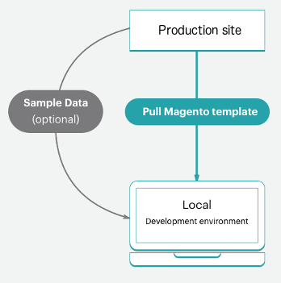

# Flusso di lavoro progetto iniziale

L&#39;infrastruttura cloud di Adobe Commerce include un unico archivio Git con un ramo `master` per l&#39;ambiente di produzione che può essere suddiviso in rami per creare uno staging e più ambienti di integrazione per il lavoro di test e sviluppo. È possibile avere fino a quattro ambienti attivi, incluso un ambiente `master` per il server di produzione. Per una panoramica, consulta [Architettura Starter](starter-architecture.md).

Per gli ambienti, segui il flusso di lavoro [!UICONTROL Development > Staging > Production] per sviluppare e distribuire il tuo sito.

- **Ambiente di produzione (sito live)** - Fornisce un ambiente di produzione completo con tutti i servizi generati e distribuiti dal codice nel ramo `master`.
- **Ambiente di gestione temporanea** - Fornisce un ambiente di gestione temporanea completo che corrisponde all&#39;ambiente di produzione con tutti i servizi generati e distribuiti da un ramo `staging` creato mediante la clonazione da `master`.
- **Ambienti di integrazione**: fornisce fino a due ambienti di sviluppo attivi creati dal ramo `staging`. L&#39;ambiente `integration` non supporta servizi di terze parti come Fastly e New Relic.

Per i rami, puoi seguire qualsiasi metodologia di sviluppo. Ad esempio, puoi seguire una metodologia Agile come scrum per creare rami per ogni sprint.

Da ogni sprint, puoi creare rami per ogni storia dell’utente. Tutte le storie diventano testabili. Puoi eseguire l’unione continua al ramo sprint e convalidarlo su base continua. Al termine dello sprint, è possibile unire il ramo sprint a `master` per distribuire tutte le modifiche sprint alla produzione senza dover affrontare un collo di bottiglia di test.

## Flusso di lavoro di sviluppo

Lo sviluppo e la distribuzione nei piani iniziali iniziano con il progetto iniziale. Crea il progetto con il &quot;sito vuoto&quot;, un archivio di codice di modello Adobe Commerce on cloud infrastructure con un archivio completamente preparato. In questo modo viene creato un ramo `master` con una copia del codice dall&#39;ambiente di produzione.

Il flusso di lavoro di sviluppo include quanto segue:

- [Clona e branch](#clone-and-branch) da `master` per creare `staging` e branch di sviluppo
- [Sviluppa codice](#develop-code) e installa le estensioni localmente in un ramo di sviluppo, inclusi [!DNL Composer] aggiornamenti
- [Configura](#configure-store) le impostazioni di archivio ed estensione
- [Genera file di gestione della configurazione](#generate-configuration-management-files)
- [Codice push](#push-code-and-test) e configurazione da compilare e distribuire negli ambienti `staging` e `production`


Hai anche a disposizione alcuni passaggi facoltativi per sviluppare e testare il codice e i dati dello store:

- [Installa i dati di esempio](#optional-install-sample-data) nell&#39;archivio
- [Estrarre i dati dell&#39;archivio di produzione](#optional-pull-production-data) negli ambienti

Questo processo presuppone che tu abbia configurato l&#39;[area di lavoro per sviluppatori locale](../development/overview.md).

### Clona e ramo

Per un nuovo progetto Starter Plan, un ramo `master` è stato clonato dall&#39;archivio Git di Adobe Commerce sull&#39;infrastruttura cloud. Per iniziare a creare diramazioni e lavorare con il codice, clonare il ramo `master` nell&#39;ambiente locale.

Il formato del comando di clonazione Git è:

```bash
git fetch origin
```

```bash
git pull origin <environment-ID>
```

La prima volta che inizi a lavorare nei rami per il progetto iniziale, crea un ramo `staging`. In questo modo viene creato un ramo di codice corrispondente al ramo `master` che viene distribuito in un ambiente di staging per testare la configurazione e le modifiche al codice prima della distribuzione nell&#39;ambiente di produzione.

Quindi, crea rami da `staging` per sviluppare codice, aggiungere estensioni e configurare integrazioni di terze parti. Ogni volta che sviluppi codice personalizzato, aggiungi estensioni, integri con un servizio di terze parti e lavori in un ramo di sviluppo creato dal ramo `staging`. Sono disponibili quattro ambienti di integrazione attivi. Quando invii un ramo attivo, uno di questi ambienti di integrazione distribuisce automaticamente il codice da testare.

Il formato del comando del ramo Git è:

```bash
git checkout <branch-name>
```

Il formato del comando Cloud CLI `branch` è:

```bash
magento-cloud environment:branch <environment-name> <parent-environment-ID>
```


### Sviluppa codice

Utilizzando il ramo base di Adobe Commerce sul codice dell’infrastruttura cloud, puoi iniziare a installare estensioni, sviluppare codice personalizzato, aggiungere temi e molto altro.

Utilizza una strategia di ramificazione con il tuo lavoro di sviluppo. L’utilizzo di un ramo per eseguire tutto il lavoro in una sola volta potrebbe rendere difficile il test. Ad esempio, puoi seguire le metodologie di integrazione continua e sprint per lavorare:

- Aggiungi alcune estensioni e configurale con il primo ramo
- Invia il codice, verifica e unisci a Staging e quindi Produzione
- Configurazione completa dei servizi in `services.yaml` e aggiunta di un tema
- Invia il codice, verifica e unisci a Staging e quindi Produzione
- Integrare con un servizio di terze parti
- Invia il codice, verifica e unisci a Staging e quindi Produzione

Fino a quando il tuo negozio non sarà completamente costruito, configurato e pronto per l&#39;avvio. Ma continua a leggere, ci sono molte opzioni per il tuo store e la configurazione del codice.

>[!NOTE]
>
>Non completare ancora alcuna configurazione nella workstation locale.


### Configura archivio

Quando si è pronti a configurare l&#39;archivio, inviare tutto il codice all&#39;ambiente `integration`. Configura le impostazioni dello store da Admin per l’ambiente di integrazione, non dall’ambiente locale. Per trovare l&#39;URL, fare clic su **Accedi al sito** in [!DNL Cloud Console]

Per informazioni sulle configurazioni, consulta la documentazione di Adobe Commerce e delle estensioni installate. Di seguito sono riportati alcuni collegamenti e idee utili per iniziare:

- [Best practice per la configurazione dell&#39;archivio](../store/best-practices.md) per best practice specifiche nel cloud
- [Configurazione di base](https://experienceleague.adobe.com/it/docs/commerce-admin/start/setup/store-details) per accesso amministratore archivio, nome, lingue, valute, branding, siti, visualizzazioni archivio e altro ancora
- [Tema](https://experienceleague.adobe.com/it/docs/commerce-admin/content-design/content-menu#design-features) per il tuo aspetto del sito e dei negozi, inclusi CSS e layout
- [Configurazione del sistema](https://experienceleague.adobe.com/it/docs/commerce-admin/systems/guide-overview) per ruoli, strumenti, notifiche e la chiave di crittografia per il database
- Impostazioni delle estensioni utilizzando la relativa documentazione

Oltre alle impostazioni di solo archivio, puoi configurare ulteriormente più siti e archivi, servizi configurati e altro ancora. Consulta [Configurare l&#39;archivio](../store/overview.md).

### Genera file di gestione della configurazione

Se hai familiarità con Adobe Commerce, potresti essere preoccupato di come ottenere le impostazioni di configurazione dal database in fase di sviluppo agli ambienti di staging e produzione. In precedenza, era necessario copiare tutte le impostazioni di configurazione su carta o su un file, quindi applicare manualmente le impostazioni ad altri ambienti. Oppure è possibile che il database sia stato scaricato e che i dati siano stati inviati a un altro ambiente.

Adobe Commerce su infrastruttura cloud fornisce un set di due comandi [Gestione configurazione](../store/store-settings.md) che esportano le impostazioni di configurazione dall&#39;ambiente in un file. Questi comandi sono disponibili solo per **Adobe Commerce sull&#39;infrastruttura cloud 2.2 e versioni successive**.

- `php .vendor/bin/ece-tools config:dump` - Esporta solo le impostazioni di configurazione immesse o modificate dai valori predefiniti in un file di configurazione. _Consigliato_.
- `php bin/magento app:config:dump` - Esporta tutte le impostazioni di configurazione, incluse quelle modificate e quelle predefinite, in un file di configurazione.

Il file generato è `app/etc/config.php`.

Genera il file nell’ambiente di integrazione in cui hai configurato Adobe Commerce. Genera il file, aggiungilo al ramo e distribuiscilo.

**Note importanti** sulla gestione della configurazione:

- Qualsiasi impostazione di configurazione inclusa nel file generato dal comando `app:config:dump` non può essere modificata o è di sola lettura nell&#39;ambiente distribuito. Per questo motivo Adobe consiglia di utilizzare il comando `.vendor/bin/ece-tools config:dump`.

  Ad esempio, installi un modulo per Fastly nell’ambiente di sviluppo. Puoi configurare questo modulo solo nell’ambiente di staging e produzione. L&#39;utilizzo del comando `.vendor/bin/ece-tools config:dump` consente di mantenere i campi predefiniti modificabili quando si distribuiscono le modifiche di sviluppo nell&#39;ambiente di staging e produzione.

- Il file generato può essere lungo a seconda delle dimensioni della distribuzione. Il comando `.vendor/bin/ece-tools config:dump` genera un file di dimensioni inferiori rispetto al file generato dal comando `app:config:dump`.

Se utilizzi Adobe Commerce versione 2.2 o successiva, i comandi di gestione della configurazione forniscono una funzione aggiuntiva per proteggere i dati sensibili, come le credenziali sandbox per un modulo PayPal. Durante il processo di esportazione, tutti i valori che contengono dati sensibili vengono esportati in un file di configurazione separato: `env.php` nella directory `app/etc/`. Il file rimane nell’ambiente locale e non viene copiato quando si invia il codice a un altro ramo. Puoi anche creare variabili di ambiente con comandi CLI in tutte le versioni di Adobe Commerce su infrastrutture cloud.


Consulta [Gestione configurazione](../store/store-settings.md).

### Codice push e test

A questo punto, è necessario disporre di un ramo di codice sviluppato con un file di configurazione (`config.local.php` o `config.php`) pronto per il test.

Ogni volta che invii il codice dal tuo ambiente locale, viene eseguita una serie di script di build e distribuzione. Questi script generano nuovo codice e lo distribuiscono nell&#39;ambiente remoto. Ad esempio, se stai inviando un ramo di sviluppo dall’ambiente locale al ramo remoto, un ambiente corrispondente aggiorna servizi, codice e contenuto statico.

Puoi accedere direttamente a questo ambiente con un URL store, un URL amministratore e un SSH. Questi ambienti includono un server web, un database e servizi configurati. Quando è pronto, puoi iniziare a distribuire e testare nell’ambiente di staging.

Per ulteriori informazioni, vedere [Flusso di lavoro di distribuzione](#deployment-workflow).

### Facoltativo: installare i dati di esempio

Se hai bisogno di alcuni dati di esempio durante lo sviluppo del tuo archivio, puoi installare dati di esempio. Questi dati simulano un archivio attivo, inclusi clienti, prodotti e altri dati. Questi dati di esempio funzionano al meglio con un’installazione di Adobe Commerce su modello di infrastruttura cloud per &quot;sito vuoto&quot; durante la creazione del progetto. Come best practice, rimuovi i dati di esempio prima di andare &quot;live&quot;. Vedi [Installare dati di esempio facoltativi](../test/sample-data.md).



### Facoltativo: estrarre i dati di produzione

Aggiungere tutti i prodotti, i cataloghi, il contenuto del sito e così via direttamente all&#39;ambiente `production`. Aggiungendo questi dati all&#39;ambiente di produzione, è possibile fornire prezzi aggiornati, coupon, scorte di magazzino, annunci di vendita, informazioni sulle offerte future e altro ancora per i clienti. Questi dati non includono le configurazioni di estensione, che puoi configurare nel ramo di sviluppo locale.

Quando sviluppi funzioni, aggiungi estensioni e progetta temi, è utile disporre di dati reali su cui lavorare. In qualsiasi momento, puoi [creare un&#39;immagine del database](../storage/database-dump.md) dall&#39;ambiente di produzione e inviarla agli ambienti di staging e integrazione in base alle esigenze.

Per facilitare l’esportazione dei dati di produzione come dati di test da utilizzare negli ambienti di staging e integrazione:

- [Esegui i comandi CLI delle utilità di supporto](https://experienceleague.adobe.com/docs/commerce-operations/configuration-guide/cli/run-support-utilities.html?lang=it) (scelta consigliata) durante l&#39;esportazione di un backup protetto dei dati del cliente e dell&#39;archivio utilizzando la chiave di crittografia Adobe Commerce

- Strumento [Raccolta dati](https://experienceleague.adobe.com/it/docs/commerce-admin/systems/tools/support#data-collector) per la generazione e l&#39;esportazione di dati

Per eseguire la migrazione di questi dati, vedere [Eseguire la migrazione e distribuire file e dati statici](../deploy/staging-production.md#migrate-static-files).


>[!NOTE]
>
>Prima di inviare i dati a un altro ambiente, è consigliabile bonificare i dati. Sono disponibili alcune opzioni, tra cui [utilizzare le utilità di supporto](https://experienceleague.adobe.com/docs/commerce-operations/configuration-guide/cli/run-support-utilities.html?lang=it) o sviluppare uno script per eliminare i dati dei clienti.

>[!WARNING]
>
>Non inviare un database da un ambiente di integrazione o di staging a un ambiente di produzione. In tal caso, i dati dell’ambiente di integrazione o di staging sovrascrivono i dati di produzione live, inclusi quelli relativi a vendite, ordini, clienti nuovi e aggiornati e altro ancora.

## Flusso di lavoro di distribuzione

Come descritto nelle informazioni sull’architettura, Adobe Commerce su infrastruttura cloud è basato su Git. La distribuzione di Adobe Commerce sull’infrastruttura cloud fa parte dei processi push Git per i rami.

Quando si invia il codice ramificato dall’ambiente locale al ramo remoto, inizia una serie di script di generazione e distribuzione.

Script di compilazione:

- Il sito nell’ambiente di destinazione continua a essere eseguito durante una build

- Verificare ed eseguire Adobe Commerce su patch e hotfix dell’infrastruttura cloud

- Compilare il codice con un registro di build e distribuzione

- Controlla Gestione configurazione se durante questa fase si verifica la distribuzione del contenuto statico

- Crea o utilizza un campione di codice non modificato per un processo più rapido

- Provisioning di tutti i servizi e le applicazioni back-end

Distribuire gli script:

- Mette il sito nell’ambiente di destinazione in modalità Manutenzione

- Distribuisce contenuto statico se non viene completato durante la generazione

- Installa o aggiorna Adobe Commerce sull’infrastruttura cloud

- Configurare il routing per il traffico

Una volta completato, il tuo negozio torna online, live, con tutto il codice e le configurazioni aggiornati.

Vedere [Processo di distribuzione](../deploy/process.md).

### Invia a staging e test

Invia sempre il codice in iterazioni all&#39;ambiente `staging` per il test completo. La prima volta che utilizzi questo ambiente, devi configurare alcuni servizi, tra cui [Fastly](/help/cloud-guide/cdn/fastly.md) e [New Relic](../monitor/new-relic-service.md). Inoltre, configura gateway di pagamento, spedizione, notifiche e altri servizi vitali con sandbox o credenziali di test.

La gestione temporanea è un ambiente di preproduzione che fornisce tutti i servizi e le impostazioni il più vicino possibile alla produzione. Esegui test approfonditi di ogni servizio, verifica gli strumenti di test delle prestazioni, esegui test UAT come amministratore e come cliente, fino a quando ritieni che il tuo negozio sia pronto per la produzione.

Consulta [Distribuire il tuo archivio](../deploy/staging-production.md).

### Invia a produzione

Quando esegui il push al ramo `master`, esegui il push all&#39;ambiente `production`. Completa le attività di configurazione e test nell’ambiente di produzione, come hai fatto nell’ambiente di staging, con una differenza importante. Nell’ambiente di produzione, utilizza le credenziali live per la configurazione e il test. Nel momento in cui avvii il sito, i clienti possono completare gli acquisti e gli amministratori possono gestire il negozio live.

Consulta [Distribuire il tuo archivio](../deploy/staging-production.md).

### Lancio del sito

Esiste una procedura dettagliata per andare in diretta con il tuo sito. Dopo aver completato questi passaggi, il tuo negozio può servire i prodotti nel tuo tema personalizzato per la vendita immediatamente.

Vedi [Lancio del sito](../launch/overview.md).

## Integrazione continua

Seguendo le metodologie di ramificazione e sviluppo, puoi facilmente sviluppare nuove funzioni, configurare modifiche e aggiungere estensioni per sviluppare e distribuire aggiornamenti in modo continuo.

Tutti gli ambienti dell’infrastruttura cloud supportano l’integrazione continua per aggiornamenti costanti. Questo flusso di lavoro supporta rilasci più volte al giorno o secondo una pianificazione impostata in base alle esigenze aziendali.

- Creare rami di sviluppo con funzioni e modifiche future

- Verifica il codice nell&#39;ambiente `integration`

- Distribuisci e verifica nell&#39;ambiente `staging`

- Distribuisci nell&#39;ambiente `production`
