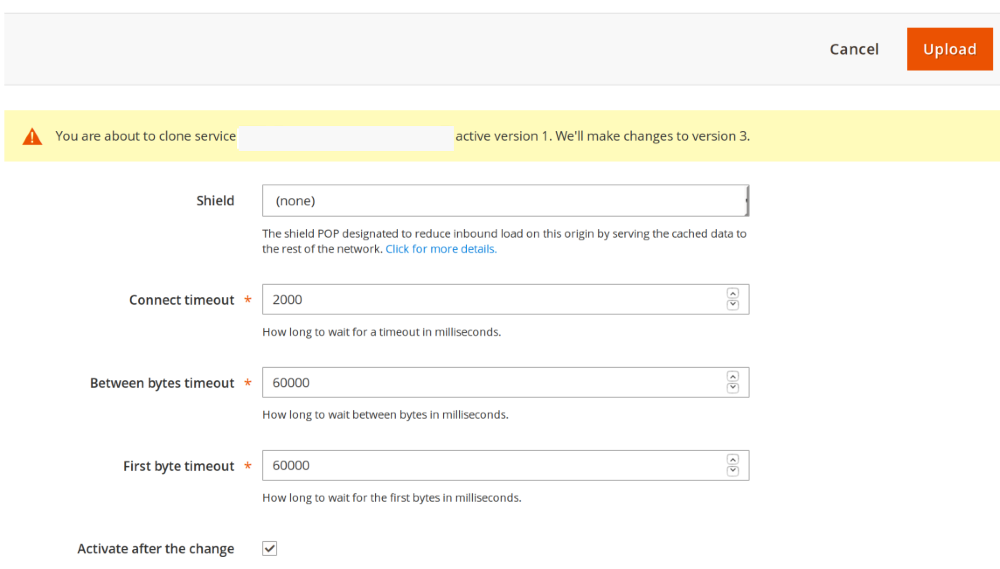

# Personalizza configurazione cache

Dopo aver configurato e testato il servizio Fastly negli ambienti di staging e produzione, rivedi e personalizza le impostazioni di configurazione della cache. Ad esempio, puoi aggiornare le impostazioni per forzare TLS a reindirizzare le richieste HTTP a Fastly, aggiornare le impostazioni di rimozione e abilitare l’autenticazione di base per proteggere il sito tramite password durante lo sviluppo.

Le sezioni seguenti forniscono una panoramica e istruzioni per la configurazione di alcune impostazioni della cache. Per ulteriori informazioni sulle opzioni di configurazione disponibili, consulta la documentazione del [modulo CDN Fastly per Magento 2](https://github.com/fastly/fastly-magento2/tree/master/Documentation).

## Forza TLS

Fastly fornisce l&#39;opzione _Force TLS_ per reindirizzare le richieste non crittografate (HTTP) a Fastly. Dopo aver eseguito il provisioning dell&#39;ambiente di staging o produzione con un [certificato SSL/TLS valido](fastly-configuration.md#provision-ssltls-certificates), puoi aggiornare la configurazione Fastly per l&#39;archivio per abilitare l&#39;opzione Force TLS. Consulta la [Guida di Force TLS](https://github.com/fastly/fastly-magento2/blob/master/Documentation/Guides/FORCE-TLS.md) in _Fastly CDN Module per Magento 2_.

>[!NOTE]
>
>L’abilitazione dell’opzione Forza TLS è una best practice consigliata per Adobe Commerce sugli archivi dell’infrastruttura cloud.

## Estendi timeout rapido

La configurazione del servizio Fastly specifica un periodo di timeout predefinito di 180 secondi per le richieste HTTPS all’amministratore. Qualsiasi elaborazione di richiesta che supera il periodo di timeout restituisce un errore 503. Di conseguenza, puoi ricevere 503 errori in risposta a richieste che richiedono una lunga elaborazione o quando tenti di eseguire operazioni in blocco.

Per completare le azioni in blocco che richiedono più di 3 minuti, modifica _Admin path timeout_ value_ per evitare errori 503.

>[!NOTE]
>
>Se hai specificato un endpoint percorso amministratore personalizzato nel campo **Percorso amministratore personalizzato** in **Archivi** > **Configurazione** > **Avanzate** > **Amministratore** > **URL base amministratore**, dovrai impostare anche la [Variabile ADMIN_URL](../environment/variables-admin.md#change-the-admin-url) in tale ambiente sullo stesso valore. Se le impostazioni sono diverse, il timeout non funzionerà.
>
>Per estendere i parametri di timeout Fastly per utenti diversi dall&#39;amministratore nell&#39;interfaccia utente Fastly, vedere [Aumentare i timeout per i processi lunghi](https://github.com/fastly/fastly-magento2/blob/master/Documentation/Guides/Edge-Modules/EDGE-MODULE-INCREASE-TIMEOUTS-LONG-JOBS.md).

**Per estendere il timeout Fastly per l&#39;amministratore**:

{{admin-login-step}}

1. Fai clic su **Archivi** > Impostazioni > **Configurazione** > **Avanzate** > **Sistema** ed espandi **Cache a pagina intera**.

1. Nella sezione _Fastly Configuration_, espandere **Advanced Configuration**.

1. Imposta il valore **Timeout percorso amministratore** in secondi. Questo valore non può essere superiore a 10 minuti (600 secondi).

>[!NOTE]
>
>L&#39;impostazione di configurazione **_Timeout percorso amministratore_** non controlla i valori di timeout al di fuori di Adobe Commerce, ad esempio Timeout Fastly WAF. Per regolare il valore di timeout Fastly WAF, è necessario aprire un ticket di supporto Adobe per aggiornarlo nel servizio Fastly.

1. Fai clic su **Salva configurazione** nella parte superiore della pagina.

1. Dopo il ricaricamento della pagina, seleziona **Carica VCL in Fastly** nella sezione _Fastly Configuration_.

Recupera il percorso di amministrazione per la generazione del file VCL dal file di configurazione `app/etc/env.php`.

## Configurare le opzioni di eliminazione

In Fastly fornisce diversi tipi di opzioni di eliminazione nella pagina Gestione cache di Magento, tra cui opzioni per rimuovere la categoria di prodotto, le risorse di prodotto e il contenuto. Quando questa opzione è attivata, Fastly controlla la presenza di eventi per eliminare automaticamente tali cache. Se disattivi un’opzione di eliminazione, puoi rimuovere manualmente le cache Fastly dopo aver completato gli aggiornamenti tramite la pagina Gestione cache.

Le opzioni di eliminazione includono:

- **Elimina categoria**-Elimina il contenuto della categoria di prodotto (non il contenuto del prodotto) quando si aggiunge e si aggiorna un singolo prodotto. Puoi mantenere disattivato e abilitare l’eliminazione del prodotto, che elimina i prodotti e le categorie di prodotti.
- **Elimina prodotto**-Elimina tutto il contenuto di prodotti e categorie di prodotti durante il salvataggio di una singola modifica in un prodotto. L’abilitazione dell’eliminazione del prodotto può essere utile per ottenere immediatamente aggiornamenti ai clienti quando si modifica un prezzo, si aggiunge un’opzione di prodotto e quando l’inventario del prodotto è esaurito.
- **Rimuovi pagina CMS**-Elimina il contenuto della pagina durante l&#39;aggiornamento e l&#39;aggiunta di pagine a Adobe Commerce CMS. Ad esempio, potrebbe essere utile eseguire la rimozione durante l&#39;aggiornamento dei Termini e Condizioni o delle Regole sulla restituzione. Se queste modifiche vengono apportate raramente, è possibile disattivare la rimozione automatica.
- **Eliminazione temporanea**-Imposta il contenuto modificato su non aggiornato ed esegue l&#39;eliminazione in base al tempo non aggiornato. Oltre agli intervalli non aggiornati, ai clienti vengono distribuiti contenuti non aggiornati mentre Fastly aggiorna i contenuti in background.

**Per configurare le opzioni di eliminazione rapida**:

1. Nella sezione _Fastly Configuration_, espandere **Advanced Configuration** per visualizzare le opzioni di eliminazione.

1. Per ogni opzione di eliminazione, selezionare **Sì** per abilitare la rimozione automatica oppure **No** per disabilitare la rimozione automatica.

   Quando si disabilita un&#39;opzione di eliminazione, è necessario eliminare manualmente la cache per tale categoria dalla pagina _Gestione cache_.

1. Fai clic su **Salva configurazione** nella parte superiore della pagina.

1. Dopo il ricaricamento della pagina, seleziona **Carica VCL in Fastly** nella sezione _Fastly Configuration_.

Per ulteriori informazioni, vedere [le opzioni di configurazione Fastly](https://github.com/fastly/fastly-magento2/blob/21b61c8189971275589219d418332798efc7db41/Documentation/CONFIGURATION.md#further-configuration-options).

## Configurare la gestione GeoIP

Il modulo Fastly include la gestione GeoIP per reindirizzare automaticamente i visitatori o fornire un elenco di store che corrispondono al codice del paese ottenuto. Se utilizzi già un’estensione per la gestione GeoIP, potrebbe essere necessario verificare le funzioni con le opzioni Fastly.

**Per configurare la gestione GeoIp**:

{{admin-login-step}}

1. Fai clic su **Archivi** > Impostazioni > **Configurazione** > **Avanzate** > **Sistema** ed espandi **Cache a pagina intera**.

1. Nella sezione _Fastly Configuration_, espandere **Advanced Configuration**.

1. Scorri verso il basso e seleziona **Sì** per **Abilita GeoIP**. Vengono visualizzate ulteriori opzioni di configurazione.

1. Per Azione GeoIP, seleziona se il visitatore viene automaticamente reindirizzato con **Reindirizzamento** o se gli viene fornito un elenco di store tra cui effettuare la selezione con **Finestra di dialogo**.

1. Per **Mappatura paese**, seleziona **Aggiungi** per immettere un codice paese di due lettere da mappare a un archivio Adobe Commerce specifico da un elenco.

   

1. Fai clic su **Salva configurazione** nella parte superiore della pagina.

1. Dopo il ricaricamento della pagina, seleziona **Carica VCL in Fastly** nella sezione _Fastly Configuration_.

>[!NOTE]
>
>L’attuale implementazione del modulo Adobe Commerce Fastly GeoIP non supporta i reindirizzamenti tra più siti web.

Fastly fornisce anche una serie di [funzionalità VCL correlate alla geolocalizzazione](https://developer.fastly.com/reference/vcl/variables/geolocation/) per la codifica di geolocalizzazione personalizzata.

## Abilitare i moduli Fastly Edge

Fastly Edge Modules è un framework flessibile che consente di definire i componenti dell’interfaccia utente e il codice VCL associato tramite un modello. Questi moduli semplificano la personalizzazione e l’estensione della configurazione del servizio Fastly tramite l’interfaccia utente, anziché utilizzare snippet VCL personalizzati.

I moduli Edge ti consentono di abilitare funzionalità specifiche come intestazioni CORS, riscritture di Cloud Sitemap e di configurare l’integrazione tra il tuo store Adobe Commerce e altri CMS o back-end.

Per accedere al menu Moduli di Edge per visualizzare, configurare e gestire i moduli disponibili, attiva l&#39;opzione _Abilita moduli Fastly Edge_. Consulta [Moduli Fastly Edge](https://github.com/fastly/fastly-magento2/blob/master/Documentation/Guides/Edge-Modules/EDGE-MODULES.md) nella documentazione del modulo Fastly CDN.

## Configurare back-end e schermatura origine

Le impostazioni back-end consentono di ottimizzare le prestazioni in modo rapido con schermatura origine e timeout. Un _back-end_ è una posizione specifica (IP o dominio) con configurato lo scudo di origine e le impostazioni di timeout per la verifica e la fornitura di contenuto nella cache.

_Schermatura origine_ indirizza tutte le richieste per l&#39;archivio a un punto di presenza specifico (POP). Quando viene ricevuta una richiesta, il POP controlla il contenuto memorizzato nella cache e lo fornisce. Se non viene memorizzato in cache, continua fino a Shield POP (POP schermato) e poi al server di origine che memorizza in cache il contenuto. Gli scudi riducono il traffico direttamente all&#39;origine.

Il codice VCL Fastly predefinito specifica i valori predefiniti per la schermatura di origine e i timeout per l’Adobe Commerce sui siti dell’infrastruttura cloud. In alcuni casi, potrebbe essere necessario modificare i valori predefiniti. Ad esempio, se si verificano errori TTFB (Time to First Byte), potrebbe essere necessario regolare il valore _first byte timeout_.

>[!NOTE]
>
>Se il tuo sito richiede un&#39;integrazione di back-end come [Wordpress](fastly-vcl-wordpress.md), personalizza la configurazione del servizio Fastly per aggiungere il back-end e gestire i reindirizzamenti dall&#39;archivio Adobe Commerce a Wordpress. Per informazioni dettagliate, consulta [Moduli Fastly Edge - Altra integrazione CMS/Backend](https://github.com/fastly/fastly-magento2/blob/master/Documentation/Guides/Edge-Modules/EDGE-MODULE-OTHER-CMS-INTEGRATION.md) nella documentazione del modulo Fastly.

**Per esaminare la configurazione delle impostazioni di back-end**:

{{admin-login-step}}

1. Fai clic su **Archivi** > Impostazioni > **Configurazione** > **Avanzate** > **Sistema** ed espandi **Cache a pagina intera**.

1. Espandi la sezione **Fastly Configuration**.

1. Espandere **Impostazioni back-end** e selezionare l&#39;ingranaggio per controllare il back-end predefinito. Viene visualizzata una finestra modale che mostra le impostazioni correnti con le opzioni per modificarle.

   

1. Selezionare la posizione **Scudo** (o il centro dati).

   La configurazione Fastly predefinita per il progetto imposta la posizione più vicina all’area del servizio Cloud. Se è necessario modificarlo, selezionare una posizione vicina a quella predefinita.

1. Modificare i valori di timeout (in microsecondi) per la connessione allo scudo, il tempo tra i byte e il tempo per il primo byte. È consigliabile mantenere le impostazioni di timeout predefinite.

1. Facoltativamente, selezionare per **attivare il backend e lo scudo dopo la modifica o il salvataggio**.

1. Fai clic su **Carica** per salvare le modifiche e caricarle nei server Fastly.

1. In Amministrazione, seleziona **Salva configurazione**.

Per ulteriori informazioni, vedere la [Guida alle impostazioni back-end](https://github.com/fastly/fastly-magento2/blob/21b61c8189971275589219d418332798efc7db41/Documentation/Guides/BACKEND-SETTINGS.md) nella documentazione del modulo Fastly.

## Autenticazione di base

L’autenticazione di base è una funzione che protegge con un nome utente e una password ogni pagina e risorsa del sito.

Adobe **sconsiglia** di attivare l&#39;autenticazione di base nell&#39;ambiente di produzione. Puoi configurarlo in Staging per proteggere il sito durante il processo di sviluppo. Consulta la [Guida all&#39;autenticazione di base](https://github.com/fastly/fastly-magento2/blob/master/Documentation/Guides/BASIC-AUTH.md) nella documentazione del modulo CDN Fastly.

Se aggiungi l’accesso utente e abiliti l’autenticazione di base nella gestione temporanea, puoi comunque accedere all’amministratore senza richiedere credenziali aggiuntive.

>[!NOTE]
>
>**non** controlla [!UICONTROL Enable HTTP access control] nella console cloud per individuare eventuali ambienti in cui Fastly è abilitato (ad esempio gli ambienti di staging o di produzione non live). Se il controllo degli accessi è configurato in questo modo, gli utenti che in precedenza avevano accesso potrebbero comunque poter accedere al sito se le loro credenziali rimangono memorizzate nella cache da Fastly, anche dopo che il loro accesso è stato annullato.

## Creare snippet VCL personalizzati

Fastly supporta una versione personalizzata del linguaggio di configurazione della vernice (VCL) per personalizzare la configurazione del servizio Fastly. Ad esempio, puoi consentire, bloccare o reindirizzare l’accesso a utenti o indirizzi IP specifici utilizzando blocchi di codice VCL con dizionari Edge e Access Control List (ACL).

Per istruzioni su come creare snippet VCL personalizzati, dizionari perimetrali e ACL, vedere [Frammenti VCL personalizzati](fastly-vcl-custom-snippets.md).

>[!NOTE]
>
>Prima di aggiungere codice VCL personalizzato, dizionari perimetrali e ACL alla configurazione del modulo Fastly, verificare che il servizio di caching Fastly funzioni con la configurazione predefinita. Vedi [Configura Fastly](fastly-configuration.md).

## Gestione domini

Per i progetti Starter e Pro è possibile utilizzare l&#39;opzione [!UICONTROL Domains] per aggiungere e gestire la configurazione del dominio Fastly per l&#39;archivio.

- Per i progetti iniziali, vai all&#39;URL del progetto nella scheda [!UICONTROL Domains] in [!DNL Cloud Console] per aggiungere l&#39;URL del progetto.

- Per i progetti Pro, invia un [ticket di supporto Adobe Commerce](https://experienceleague.adobe.com/docs/commerce-knowledge-base/kb/help-center-guide/magento-help-center-user-guide.html?lang=it#submit-ticket) per aggiungere il dominio alla configurazione del progetto cloud. Il team di supporto aggiorna anche la configurazione dell’account Adobe Commerce Fastly per aggiungere il dominio.

**Per gestire la configurazione Fastly Domain dall&#39;amministratore**:

{{admin-login-step}}

1. Seleziona **Archivi** > Impostazioni > **Configurazione** > **Avanzate** > **Sistema** ed espandi **Cache a pagina intera**.

1. Nella sezione Amministrazione _Configurazione rapida_ selezionare **Domini**.

1. Fare clic su **Gestisci domini** per aprire la pagina Domini.

1. Aggiungi i nomi di primo livello e sottodominio per gli archivi nell’ambiente Cloud.

   Puoi specificare solo i domini che sono già stati aggiunti alla configurazione dell’infrastruttura cloud.

   

1. Fai clic su **Attiva** per aggiornare la configurazione del dominio Fastly.

>[!NOTE]
>
>Se lo stesso dominio è stato configurato su un account Fastly diverso, è necessario inviare un ticket di supporto Adobe Commerce per richiedere la delega del dominio prima di poter aggiungere il dominio ad Adobe Commerce. Vedi [Più account Fastly e domini assegnati](fastly.md#multiple-fastly-accounts-and-assigned-domains).

## Abilita modalità manutenzione

Utilizzare l&#39;opzione _Modalità manutenzione_ per consentire l&#39;accesso amministrativo al sito dagli indirizzi IP specificati e restituire una pagina di errore per tutte le altre richieste.

**Per attivare la modalità di manutenzione con accesso amministrativo**:

1. Apri la sezione _Fastly configuration_ nell&#39;amministratore.

1. Nella sezione _ACL di Edge_ aggiornare l&#39;elenco di controllo di accesso (ACL) `maint_allow` con gli indirizzi IP amministrativi che possono accedere all&#39;archivio mentre è in modalità di manutenzione.

   

1. Nella sezione _Modalità manutenzione_, selezionare **Attiva modalità manutenzione**.

   Dopo aver attivato la modalità di manutenzione, tutto il traffico viene bloccato, ad eccezione delle richieste provenienti dagli indirizzi IP nell&#39;ACL `maint_allowlist`. È possibile aggiornare `maint_allowlist` per modificare gli indirizzi IP nell&#39;ACL.

   Per istruzioni di configurazione dettagliate, consulta la [guida alla modalità di manutenzione](https://github.com/fastly/fastly-magento2/blob/master/Documentation/Guides/MAINTENANCE-MODE.md) nella documentazione del modulo Fastly CDN per Magento 2.
