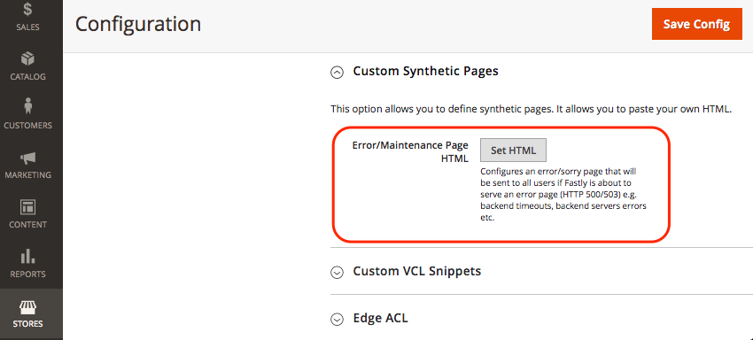

# Personalizzare le pagine di errore e manutenzione

Quando una richiesta all’origine Fastly ha esito negativo, Fastly restituisce pagine di risposta predefinite con formattazione di base e messaggi generici che possono creare confusione per gli utenti. Ad esempio, Fastly restituisce la seguente pagina di errore predefinita quando una richiesta all’origine Fastly non riesce a causa di un errore 503.


Puoi aggiornare la configurazione dell’archivio Adobe Commerce per sostituire alcune pagine di risposta predefinite con pagine che presentano messaggi più semplici e uno stile HTML migliorato, come illustrato nell’esempio seguente.


Attualmente, puoi personalizzare le seguenti pagine di risposta Fastly per il progetto di infrastruttura cloud di Adobe Commerce.

- [Errori del server - Errore interno del server, timeout o interruzioni della manutenzione del sito (codice di errore 500 o superiore)](#customize-the-503-error-page)
- [Eventi di blocco di WAF che si verificano quando WAF rileva traffico di richieste sospetto (403 Forbidden)](#customize-the-waf-error-page)

**Requisiti di codifica HTML:**

Il codice HTML per la pagina personalizzata deve soddisfare i seguenti requisiti:

- Il contenuto può contenere fino a 65.535 caratteri.
- Specifica tutti i file CSS in linea nell’origine HTML.
- Crea il bundle delle immagini nella pagina HTML utilizzando base64 in modo che vengano visualizzate anche se Fastly è offline. Vedi [URI di dati sul sito css-tricks](https://css-tricks.com/data-uris/).

## Personalizzare la pagina di errore 503

I clienti visualizzano la pagina di errore 503 predefinita nei casi seguenti:

- Quando una richiesta all’origine Fastly restituisce uno stato di risposta maggiore di 500
- Quando l’origine Fastly è inattiva, ad esempio per timeout, attività di manutenzione o problemi di salute

Puoi personalizzare la pagina predefinita adattando il seguente codice HTML per includere uno stile che corrisponda al tema del negozio Adobe Commerce e modificando il titolo e i messaggi in base alle esigenze.

```html
<!DOCTYPE html>
<html>
   <head>
      <meta charset="UTF-8">
         <title>503</title>
   </head>
   <body>
      <p>Service unavailable</p>
   </body></html>
```

Verifica che l’origine modificata venga visualizzata correttamente nel browser. Quindi, aggiungi il codice HTML personalizzato alla configurazione Fastly.

Per aggiungere la pagina di risposta personalizzata alla configurazione Fastly:

{{admin-login-step}}

1. Seleziona **Archivi** > **Impostazioni** > **Configurazione** > **Avanzate** > **Sistema**.

1. Nel riquadro di destra espandere **Cache a pagina intera** > **Configurazione rapida** > **Pagine sintetiche personalizzate**.

   

1. Selezionare **Imposta HTML**.

1. Copia e incolla il codice sorgente per la pagina di risposta personalizzata nel campo HTML.

   

1. Seleziona **Carica** nella parte superiore della pagina per caricare l&#39;origine HTML personalizzata nel server Fastly.

1. Seleziona **Salva configurazione** nella parte superiore della pagina per salvare il file di configurazione aggiornato.

1. Aggiorna la cache.

   - Nella notifica nella parte superiore della pagina, seleziona il collegamento *Gestione cache*.

   - Nella pagina Gestione cache selezionare **Svuota cache Magento**.

## Personalizzare la pagina di errore di WAF

I clienti visualizzano la seguente pagina di errore predefinita di WAF quando una richiesta all&#39;origine Fastly non riesce con un errore `403 Forbidden` causato da un evento di blocco [WAF](fastly-waf-service.md).


Nell&#39;esempio di codice riportato di seguito viene illustrata l&#39;origine HTML per la pagina predefinita.

```html
<html>
  <head>
    <title>Magento 403 Forbidden</title>
  </head>
  <body>
    <p>The requested URL was rejected.</p>
    <p>For additional information, please contact support and provide this reference ID:</p>
    <p>"} req.http.x-request-id {"</p>
    <p><button onclick='history.back();'>Go Back</button></p>
  </body>
</html>
```

Puoi utilizzare l&#39;opzione **Pagine sintetiche personalizzate** > **Modifica pagina WAF** nel menu di configurazione Fastly per personalizzare il codice predefinito per il progetto Adobe Commerce su infrastruttura cloud. Quando modifichi il codice, conserva la seguente riga che fornisce l’ID di riferimento per l’evento di blocco WAF:

```html
<p>"} req.http.x-request-id {"</p>
```

>[!NOTE]
>
>L’opzione Modifica WAF è disponibile solo se il servizio Managed Cloud WAF è abilitato per il progetto di infrastruttura cloud di Adobe Commerce.

**Per modificare la pagina di errore di WAF**:

1. [Accedi all&#39;amministratore](../../get-started/onboarding.md#access-your-admin-panel).

1. Seleziona **Archivi** > **Impostazioni** > **Configurazione** > **Avanzate** > **Sistema**.

1. Nel riquadro di destra espandere **Cache a pagina intera** > **Configurazione rapida** > **Pagine sintetiche personalizzate**.

   

1. Selezionare **Modifica pagina WAF**.

1. Compila i campi per aggiornare HTML.

   

   - **Stato** — Selezionare lo stato `403 Forbidden`.
   - **Tipo MIME** — Tipo `text/html`.
   - **Contenuto** - Modifica la risposta predefinita del HTML per aggiungere CSS personalizzato e aggiornare il titolo e i messaggi in base alle esigenze.

1. Seleziona **Carica** nella parte superiore della pagina per caricare l&#39;origine HTML personalizzata nel server Fastly.

1. Seleziona **Salva configurazione** nella parte superiore della pagina per salvare il file di configurazione aggiornato.

1. Aggiorna la cache.

   - Nella notifica nella parte superiore della pagina, seleziona il collegamento **Gestione cache**.

   - Nella pagina Gestione cache selezionare **Svuota cache Magento**.

## Visualizza il numero della segnalazione errori

Per impostazione predefinita, Fastly nasconde tutti gli errori Adobe Commerce dietro l&#39;errore *503 Servizio non disponibile*. Per visualizzare il numero del rapporto del registro degli errori in modo da poter trovare e rivedere i dettagli degli errori nei registri, aprire il sito Web omettendo Fastly seguendo la procedura riportata di seguito.

1. Recupera l’indirizzo IP del tuo negozio:

   - Per ambienti di staging e produzione Pro:

     ```bash
     nslookup {your_project_id}.ent.magento.cloud
     ```

   - Per gli ambienti di integrazione Pro e gli ambienti Starter:

     ```bash
     nslookup gw.{your_region}.magentosite.cloud
     ```

1. Aggiungere il dominio dell&#39;applicazione e l&#39;indirizzo IP al file hosts sulla workstation locale:

   ```text
   {server_IP} {store_domain}
   ```

1. Cancella la cache del browser e i cookie (o passa alla modalità in incognito).

1. Apri di nuovo il sito web del negozio per visualizzare il codice di errore.

1. Utilizza il codice di errore per trovare i dettagli nel file della segnalazione errori:

   - [Connettersi all’ambiente interessato utilizzando SSH](../development/secure-connections.md#connect-to-a-remote-environment)

   - Individuare il file `./var/report/{error_number}`.
