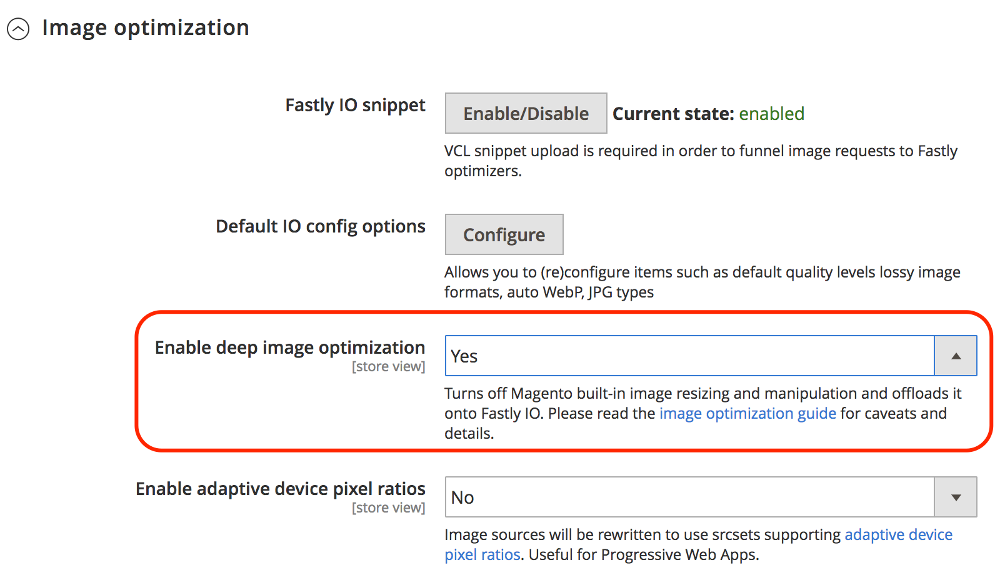

# Ottimizzazione rapida delle immagini

Fastly Image Optimization (Fastly IO) consente di manipolare e ottimizzare le immagini in tempo reale per velocizzarne la distribuzione e semplificare la manutenzione dei set di origini delle immagini per le applicazioni web dinamiche. Una volta configurato Fastly IO, offre le seguenti funzioni di ottimizzazione delle immagini:

- Forza conversione perdita
- Ottimizzazione immagine profonda
- Rapporti di pixel adattivi
- Supporto per formati immagine comuni: PNG, JPEG, GIF e WebP

Prima di abilitare e configurare l&#39;opzione I/O Fastly, è necessario impostare il servizio Fastly e configurare la schermatura Origin.

In base alle impostazioni di configurazione, lo snippet Fastly Image Optimization (Fastly IO) inserisce il codice VCL per eseguire l’ottimizzazione dell’immagine in modo da velocizzare la consegna dell’immagine del prodotto nella vetrina. Per configurare l&#39;I/O Fastly sono necessari tre passaggi: Abilita, Configura e Verifica.

## Attiva I/O veloce

Abilita Ottimizzazione Fastly Image (Fastly IO) dal pannello Amministratore caricando lo snippet VCL Fastly IO. Il frammento fornisce le istruzioni di configurazione Fastly per elaborare tutte le immagini mediante gli ottimizzatori di immagini, utilizzando le configurazioni predefinite.

**Prerequisiti:**

- Installazione o aggiornamento al modulo Fastly versione 1.2.62 o successiva
- [Configurare Fastly Origin shield e back-end](fastly-custom-cache-configuration.md#configure-back-ends-and-origin-shielding)

**Per attivare I/O veloce**:

1. Accedi al pannello locale [Amministratore](../../get-started/onboarding.md#access-your-admin-panel) come amministratore.

1. Seleziona **Archivi** > **Impostazioni** > **Configurazione** > **Avanzate** > **Sistema**.

1. Nel riquadro di destra espandere **Cache a pagina intera**.

1. Seleziona **Fastly Configuration** > **Image Optimization** per specificare le impostazioni di configurazione.

1. Nel campo _Frammento I/O_ selezionare **Attiva/Disattiva**.

1. Carica lo snippet I/O Fastly:

   - Selezionare **Opzioni di configurazione I/O predefinite** per aprire la pagina Opzioni di configurazione predefinite di ottimizzazione immagine.
   - Seleziona **Carica** per caricare lo snippet VCL sul server.

## Configura I/O veloce

Se necessario, rivedere e aggiornare le impostazioni di configurazione I/O predefinite per l&#39;ottimizzazione dell&#39;immagine. È possibile, ad esempio, modificare i livelli di qualità WebP e JPEG per i formati con perdita di dati o modificare il formato per la trasmissione delle immagini JPEG in _Progressive_ o _Baseline_. Inoltre, è possibile utilizzare Fastly IO per funzioni di ottimizzazione delle immagini più granulari, ad esempio:

- Forza conversione perdita
- Ottimizzazione immagine profonda
- Rapporti di pixel adattivi

**Per aggiornare Fastly I/O**:

1. Nella pagina _Fastly Configuration_ del campo _Default IO config options_, selezionare **Configure**.

   

1. Rivedi e aggiorna le impostazioni di configurazione Fastly IO nella pagina _Opzioni di configurazione predefinite di ottimizzazione immagine_:

   

   - **WebP automatico?** - Lascia l&#39;impostazione predefinita (`Yes`) per convertire le immagini nel formato WebP nei browser che la supportano. Se si modifica l&#39;impostazione in **No**, Fastly utilizza il tipo di file di immagine anziché convertire l&#39;immagine in formato WebP.

   - **Qualità WebP predefinita (con perdita di dati)**. Lasciare l&#39;impostazione predefinita (`85`) o digitare il livello di compressione per le immagini con formattazione di file con perdita di dati. È possibile specificare un numero intero compreso tra 1 e 100.

   - **Controlli formato JPEG predefinito**. Lasciare l&#39;impostazione predefinita (`Auto`) oppure selezionare il tipo di JPEG da utilizzare per la trasmissione di un&#39;immagine. Se il valore è impostato su _Auto_, Fastly distribuisce le immagini con il tipo di output corrispondente al tipo di input. Seleziona _Previsione_ per visualizzare le immagini riga per riga, partendo dall&#39;alto a sinistra e andando in basso a destra. Seleziona _Progressivo_ per visualizzare un&#39;immagine sfocata che diventa chiara durante il caricamento.

   - **Qualità JPEG predefinita**. Lasciare l&#39;impostazione predefinita (`85`) o digitare il livello di compressione per la qualità dei formati di file con perdita di dati. Specificare un numero intero compreso tra 1 e 100.

   - **Consentire l&#39;upscaling?** - Lascia l&#39;impostazione predefinita (`No`) oppure seleziona `Yes` per restituire immagini di dimensioni maggiori rispetto al file di origine in modo che possano rientrare nelle dimensioni richieste.

   - **Ridimensiona filtro**. Lasciare l&#39;impostazione predefinita (`Lancsoz3`) o selezionare un&#39;alternativa. Questa impostazione specifica il filtro utilizzato per fornire un&#39;immagine ridimensionata. A seconda del filtro selezionato, l’immagine ridimensionata può avere un numero di pixel maggiore o minore.

      - `Lanczos3` (impostazione predefinita) - Fornisce un&#39;immagine della migliore qualità. Aumenta la capacità di rilevare bordi e caratteristiche lineari all&#39;interno di un&#39;immagine e utilizza il ricampionamento _[!DNL sinc]_&#x200B;per fornire la migliore ricostruzione possibile.
      - `Lanczos2` - Utilizza lo stesso filtro di `Lancsoz3` ma con un&#39;approssimazione meno precisa della funzione di ricampionamento di _[!DNL sinc]_.
      - `Bicubic` - Ha un effetto di nitidezza naturale quando rimpicciolisce un&#39;immagine.
      - `Bilinear` - Ha un effetto di arrotondamento naturale quando si ingrandisce un&#39;immagine.
      - `Nearest` - Ha un effetto di pixelazione naturale quando si ridimensiona una pixel art.

1. Dopo aver specificato le impostazioni di configurazione IO per il servizio Fastly, selezionare **Annulla** per tornare alle impostazioni di configurazione Fastly.

1. Nel campo Configurazione ottimizzazione immagine _Abilita ottimizzazione immagine approfondita_, seleziona **Sì** per attivare l&#39;ottimizzazione immagine approfondita.

   

   L&#39;ottimizzazione immagine profonda è disattivata per impostazione predefinita. Quando questa funzione è abilitata, la funzione di ridimensionamento incorporata in Adobe Commerce viene disattivata e il lavoro di ridimensionamento viene scaricato nel servizio I/O Fastly. L’ottimizzazione immagine si applica solo alle immagini del prodotto. Le immagini CMS non vengono ridimensionate. Consulta la [documentazione Fastly](#deep-image-optimization).

1. Dopo aver abilitato l&#39;ottimizzazione delle immagini profonde, abilita la funzione [adaptive pixel ratios](#adaptive-pixel-ratios) per generare immagini ottimizzate per l&#39;utilizzo in siti Web dinamici.

   

   - Nel campo _Abilita rapporti pixel dispositivo adattivo_, seleziona **Sì**.
   - Nel campo _Rapporti pixel dispositivo_, accettare l&#39;impostazione predefinita oppure selezionare la casella di controllo **Input di sistema** per rimuovere l&#39;impostazione. Quindi, selezionare il rapporto desiderato. Un&#39;impostazione con proporzioni pixel del dispositivo più elevate offre immagini più grandi.

1. Seleziona **Salva configurazione**.

### Forza conversione perdita

Per impostazione predefinita, il servizio Fastly IO forza la conversione di formati senza perdita di dati come PNG, BMP o WEBP in formato JPEG/WEBP.

Il vantaggio di forzare la conversione con perdita di dati è che vengono distribuite immagini più piccole.
Ad esempio, utilizzando il formato JPEG o WEBp invece di PNG, la dimensione può essere ridotta del 60-70% a seconda del livello di qualità specificato nella configurazione di I/O Fastly.

A seconda del livello di qualità selezionato per l&#39;ottimizzazione dell&#39;immagine, è possibile percepire differenze visive nelle immagini. Ad Alpha, i canali e le trasparenze vengono eliminati e sostituiti con uno sfondo bianco, a meno che non si utilizzi l&#39;ottimizzazione immagine profonda che utilizza il colore di sfondo del tema.

Se si disattiva la conversione con perdita di dati (`WebP Auto? = No`), Fastly IO cambia le immagini JPEG in formato WEBP solo per i browser compatibili. Nessun altro tipo di immagine viene modificato. Ad esempio, se l&#39;immagine originale è PNG, l&#39;output del servizio I/O Fastly è PNG.

### Ottimizzazione immagine profonda

L&#39;ottimizzazione immagine profonda è disattivata per impostazione predefinita. L’abilitazione di questa opzione disattiva il ridimensionamento integrato di Adobe Commerce e lo scarica completamente sul servizio Fastly IO.
Questa funzionalità ridimensiona solo le immagini _product_. Le immagini CMS non vengono ridimensionate.

Se abiliti l’ottimizzazione deep image, viene aggiunta una definizione del colore di sfondo a ogni immagine definita nel tema. Di conseguenza, le immagini WebP passano da non perdenti di WebP a perdenti di WebP. Una delle principali differenze tra lossless e lossy è che lossy rilascia il canale alfa dalle immagini PNG, che fornisce immagini molto più piccole. Tuttavia, le immagini con trasparenza possono avere un aspetto dispari sulle pagine di prodotti e campagne che utilizzano uno sfondo diverso.

Ad esempio, il codice seguente rappresenta l’origine originale di un’immagine dal tema Luma:

```html

```

Quando la funzione Fastly IO Deep Image Optimization è abilitata, il codice sorgente originale per l&#39;immagine viene riscritto come mostrato nell&#39;esempio seguente:

```html

```

### Rapporti di pixel adattivi

La funzione Adaptive pixel ratio è utile per ottimizzare le immagini per le applicazioni web progressive. Consente di fornire più dimensioni e risoluzioni immagine da un file di origine dell&#39;immagine aggiungendo un `srcset` per ogni immagine prodotto.

Quando la funzione Adaptive pixel ratio è abilitata, il servizio I/O Fastly fornisce un&#39;immagine a larghezza fissa che può adattarsi a `device-pixel-ratios` variabili.
Ad esempio, il servizio modifica la definizione dell’immagine del prodotto come illustrato nell’esempio seguente:

```html

```

Consulta `srcset` [supporto browser](https://caniuse.com/#feat=srcset) e [specifica](https://html.spec.whatwg.org/multipage/embedded-content.html#attr-img-srcset).

## Convalida I/O veloce

Dopo aver abilitato e configurato Fastly IO, convalidare la configurazione eseguendo test di velocità della pagina Web con e senza Fastly IO abilitato. Inoltre, controlla le immagini nel tuo negozio per verificare le dimensioni e l&#39;aspetto delle immagini per eventuali problemi.
