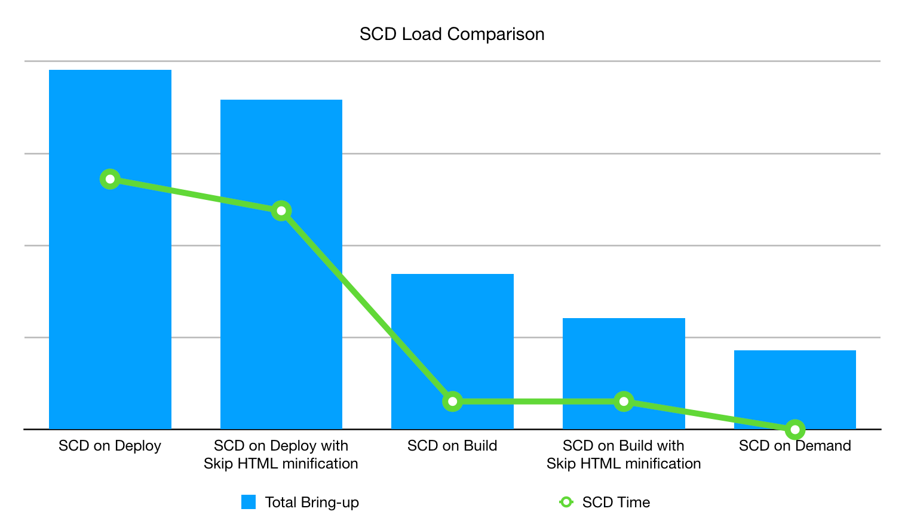

# Strategie di distribuzione dei contenuti statici

La distribuzione di contenuti statici (SCD, Static Content Deployment) ha un impatto significativo sul processo di distribuzione dello store, che dipende dalla quantità di contenuti da generare (immagini, script, CSS, video, temi, impostazioni internazionali e pagine web) e da quando generarli. Ad esempio, la strategia predefinita genera contenuto statico durante la [fase di distribuzione](process.md#deploy-phase-deploy-phase) quando il sito è in modalità manutenzione; tuttavia, questa strategia di distribuzione richiede tempo per scrivere il contenuto direttamente nella directory `pub/static` montata. Sono disponibili diverse opzioni o strategie per migliorare i tempi di implementazione in base alle esigenze.

## Ottimizzare i contenuti di JavaScript e HTML

Puoi utilizzare bundling e minimizzazione per creare contenuti JavaScript e HTML ottimizzati durante la distribuzione di contenuti statici.

### Minimizza contenuto

È possibile migliorare il tempo di caricamento SCD durante il processo di distribuzione se non si copiano i file di visualizzazione statica nella directory `var/view_preprocessed` e si genera _minified_ HTML quando richiesto. È possibile attivare questa impostazione impostando la variabile di ambiente globale [SKIP_HTML_MINIFICATION](../environment/variables-global.md#skiphtmlminification) su `true` nel file `.magento.env.yaml`.

>[!NOTE]
>
>A partire dalla versione 2002.0.13 del pacchetto `ece-tools`, il valore predefinito per la variabile SKIP_HTML_MINIFICATION è impostato su `true`.

È possibile risparmiare **altro** tempo di distribuzione e spazio su disco riducendo il numero di file dei temi non necessari. È ad esempio possibile distribuire il tema `magento/backend` in inglese e un tema personalizzato in altre lingue. Puoi configurare queste impostazioni del tema con la variabile di ambiente [SCD_MATRIX](../environment/variables-deploy.md#scdmatrix).

## Scelta di una strategia di distribuzione

Le strategie di distribuzione variano a seconda che si scelga di generare contenuto statico durante la fase _build_, _deploy_ o _on-demand_. Come mostrato nel grafico seguente, la generazione di contenuto statico durante la fase di distribuzione è la scelta meno ottimale. Anche con HTML minimizzato, ogni file di contenuto deve essere copiato nella directory `~/pub/static` montata, operazione che può richiedere molto tempo. La generazione di contenuti statici su richiesta sembra la scelta ottimale. Tuttavia, se il file di contenuto non esiste nella cache, viene generato nel momento in cui viene richiesto e questo aggiunge il tempo di caricamento all’esperienza utente. Pertanto, la generazione di contenuto statico durante la fase di build è la più ottimale.



### Impostazione di SCD sulla build

La generazione di contenuto statico durante la fase di build con HTML minimizzato rappresenta la configurazione ottimale per [**zero-downtime** implementazioni](reduce-downtime.md), noto anche come **stato ideale**. Anziché copiare i file in un&#39;unità montata, viene creato un collegamento simbolico dalla directory `./init/pub/static`.

La generazione di contenuto statico richiede l’accesso a temi e impostazioni internazionali. Adobe Commerce memorizza i temi nel file system, che è accessibile durante la fase di build; tuttavia, Adobe Commerce memorizza le lingue nel database. Il database è _non_ disponibile durante la fase di compilazione. Per generare il contenuto statico durante la fase di compilazione, è necessario utilizzare il comando `config:dump` nel pacchetto `ece-tools` per spostare le impostazioni internazionali nel file system. Legge le impostazioni locali e le salva nel file `app/etc/config.php`.

>[!NOTE]
>Dopo aver eseguito il comando `config:dump` nel pacchetto `ece-tools`, le configurazioni scaricate nel file `config.php` [ sono bloccate (disattivate) nel dashboard di amministrazione](https://experienceleague.adobe.com/en/docs/commerce-knowledge-base/kb/troubleshooting/miscellaneous/locked-fields-in-magento-admin). l’unico modo per aggiornare tali configurazioni nell’amministratore è eliminarle dal file localmente e ridistribuire il progetto.
>>Inoltre, ogni volta che si aggiunge un nuovo store/gruppo di store/sito Web all&#39;istanza, è necessario ricordarsi di eseguire il comando `config:dump` per assicurarsi che il database sia sincronizzato. Puoi anche scegliere [quali configurazioni scaricare](https://experienceleague.adobe.com/en/docs/commerce-operations/configuration-guide/cli/configuration-management/export-configuration?lang=en) nel file `config.php`.
>>Se si elimina la configurazione del gruppo store/sito Web dal file `config.php` perché i campi sono disattivati ma non vengono eseguiti, le nuove entità che non sono state scaricate verranno eliminate dal database nella distribuzione successiva.

**Per configurare il progetto in modo da generare SCD sulla build**:

1. Sulla workstation locale, passa alla directory del progetto.
1. Utilizza SSH per accedere all’ambiente remoto.

   ```bash
   magento-cloud ssh
   ```

1. Spostare le impostazioni locali nel file system, quindi aggiornare il file [`config.php`](../development/commerce-version.md#create-a-configphp-file).

1. Il file di configurazione `.magento.env.yaml` deve contenere i valori seguenti:

   - [SKIP_HTML_MINIFICATION](../environment/variables-global.md#skip_html_minification) è `true`
   - [SKIP_SCD](../environment/variables-build.md#skip_scd) nella fase di compilazione è `false`
   - [SCD_STRATEGY](../environment/variables-build.md#scd_strategy) è `compact`

1. Verificare la configurazione dell&#39;[hook post-distribuzione](../application/hooks-property.md) nel file `.magento.app.yaml`.

1. Verificare le impostazioni eseguendo la [Creazione guidata Smart per lo stato ideale](smart-wizards.md).

   ```bash
   php ./vendor/bin/ece-tools wizard:ideal-state
   ```

### Impostazione di SCD su richiesta

La generazione di SCD on-demand è ottimale per un flusso di lavoro di sviluppo nell’ambiente di integrazione. Riduce i tempi di distribuzione in modo da poter rivedere rapidamente le implementazioni ed eseguire i test di integrazione. Abilita la variabile di ambiente [SCD_ON_DEMAND](../environment/variables-global.md#scdondemand) nella fase globale del file `.magento.env.yaml`. La variabile SCD_ON_DEMAND sostituisce tutte le altre configurazioni correlate a SCD e cancella il contenuto esistente dalla directory `~/pub/static`.

Quando si utilizza la strategia SCD on-demand, è utile precaricare la cache con le pagine che si prevede di richiedere, ad esempio la home page. Aggiungere l&#39;elenco delle pagine previste nella variabile di ambiente [WARM_UP_PAGES](../environment/variables-post-deploy.md#warmuppages) nella fase di post-distribuzione del file `.magento.env.yaml`.

>[!WARNING]
>
>Non utilizzare la strategia SCD on-demand nell’ambiente di produzione.

### Ignorare SCD

A volte puoi scegliere di saltare completamente la generazione del contenuto statico. È possibile impostare la variabile di ambiente [SKIP_SCD](../environment/variables-build.md#skipscd) nella fase globale per ignorare altre configurazioni correlate a SCD. Ciò non influisce sul contenuto esistente nella directory `~/pub/static`.
