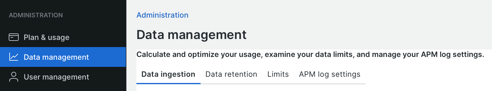

# Acquisizione dei dati

New Relic dipende dai dati avanzati per fornire un monitoraggio e un&#39;analisi efficaci, ma i set di dati di grandi dimensioni possono influire su risultati, prestazioni e conformità tempestivi. Questo argomento fornisce alcune indicazioni sulla gestione dell’acquisizione dei dati e sulle strategie per perfezionare i dati in modo che siano più efficaci.

New Relic fornisce una visualizzazione di _Gestione dati_ che riepiloga l&#39;utilizzo del piano per origine dati.

**Per visualizzare i dati e le origini di acquisizione**:

1. Dal menu utente di New Relic, fare clic su **[!UICONTROL Manage your data]**.
1. Fare clic su **[!UICONTROL Data management]** nell&#39;elenco _Amministrazione_.

   

   Nella scheda **[!UICONTROL Data ingestion]** vengono visualizzati i dati acquisiti per il giorno e l&#39;origine dei dati.
La scheda Conservazione dei dati mostra e controlla per quanto tempo vengono memorizzati i dati.

1. Selezionare la scheda **[!UICONTROL Limits]** e visualizzare i limiti per l&#39;account.

Le origini dati per Adobe Commerce includono:

- **Eventi APM**: dati evento utilizzati nei grafici e nei dashboard
- **Infrastruttura**: metriche di processo e host, ad esempio CPU, archiviazione, rete
- **Registrazione**: registri per CDN, APM e server applicazioni

I dati di registro contribuiscono in larga misura all’acquisizione. Scopri come [visualizzare e analizzare i dati di registro](log-management.md#view-and-analyze-log-data) e collaborare con il tuo rappresentante Adobe per definire una strategia per le esigenze di acquisizione e conservazione dei dati. Ulteriori informazioni sulla [gestione dell&#39;acquisizione dei dati](https://docs.newrelic.com/docs/data-apis/manage-data/manage-data-coming-new-relic/) sono disponibili nella _documentazione di New Relic_.
