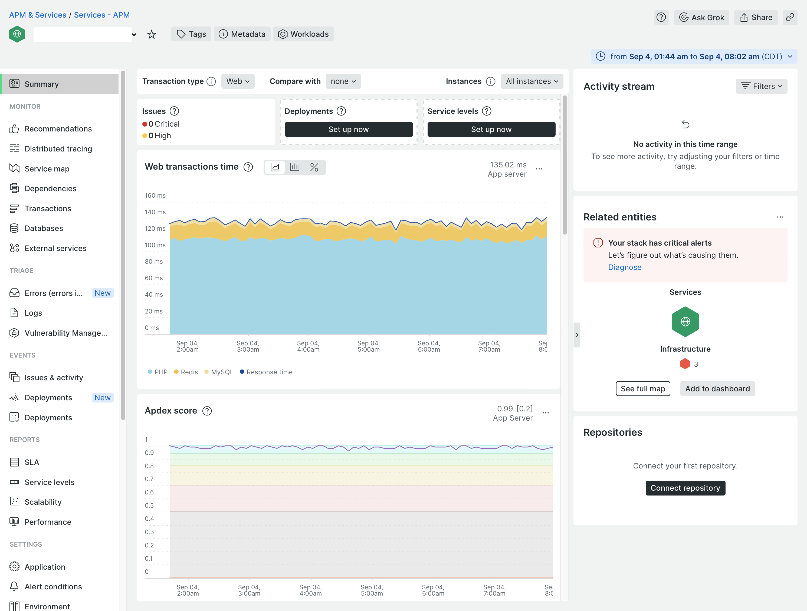

# Monitoraggio New Relic

New Relic connette e controlla l&#39;infrastruttura e l&#39;applicazione [!DNL Commerce] tramite gli agenti PHP. Dopo che un ambiente Cloud si connette a New Relic, puoi accedere al tuo account New Relic per rivedere i dati raccolti dall’agente.

Nella pagina _APM &amp; Services_, seleziona il **Riepilogo** per visualizzare le informazioni sulle transazioni relative all&#39;applicazione. Questa visualizzazione consente di identificare potenziali errori e di verificare lo stato complessivo dell’applicazione e dei servizi.

Da questa vista è possibile tenere traccia delle transazioni che incontrano risposte lente o colli di bottiglia, velocità effettiva delle applicazioni, errori Web e altro ancora.

Revisione dei dati tracciati:

- **Più dispendioso in termini di tempo**—Determinare il consumo di tempo tenendo traccia delle richieste in parallelo. Ad esempio, potresti avere il tempo di transazione più alto trascorso nelle visualizzazioni di prodotti e categorie. Se una pagina dell’account del cliente si classifica improvvisamente in un consumo elevato di tempo, l’applicazione potrebbe essere interessata da una chiamata o da prestazioni di trascinamento delle query.

- **Throughput massimo** - Identifica le pagine più visitate in base alle dimensioni e alla frequenza dei byte trasmessi.

Tutti i dati raccolti descrivono il tempo impiegato per le azioni di trasmissione di dati, query o dati _Redis_. Se le query causano problemi, New Relic fornisce informazioni per tenere traccia di tali problemi e rispondervi.

>[!TIP]
>
>Per informazioni dettagliate sull&#39;utilizzo di questi dati per la risoluzione dei problemi relativi alle prestazioni delle applicazioni, vedere [Risoluzione dei problemi relativi alle prestazioni tramite New Relic](https://experienceleague.adobe.com/docs/commerce-knowledge-base/kb/troubleshooting/miscellaneous/troubleshoot-performance-using-new-relic-on-magento-commerce.html) nel _Centro assistenza Adobe Commerce_.

## Monitorare le prestazioni con avvisi gestiti

Adobe fornisce i _criteri di avviso gestiti per Adobe Commerce_ per tenere traccia delle metriche delle prestazioni. La policy include una raccolta di avvisi che impostano soglie e attivano avvisi e notifiche critiche quando problemi di infrastruttura o applicazioni influiscono sulle prestazioni del sito. Il criterio tiene traccia delle metriche seguenti negli ambienti di produzione:

| Metrica | Raccolta dati | Disponibilità |
|:-------------------|:----------------|:----------------|
| Punteggio [!DNL Apdex] | APM | Pro e Starter |
| Utilizzo di CPU | NRI | Pro |
| Spazio su disco | NRI | Pro |
| Percentuale di errori | APM | Pro e Starter |
| Utilizzo della memoria | NRI | Pro |
| Caricamento query MariaDB | NRI | Pro |
| Memoria Redis | NRI | Pro |

Quando l’infrastruttura del sito o le condizioni dell’applicazione attivano una soglia di avviso, New Relic invia notifiche di avviso in modo da poter affrontare il problema in modo proattivo. Consulta [Avvisi gestiti per Adobe Commerce](https://experienceleague.adobe.com/docs/commerce-knowledge-base/kb/support-tools/managed-alerts/managed-alerts-for-magento-commerce.html) nel _Centro assistenza Adobe Commerce_ per informazioni dettagliate sulle soglie di avviso e sui passaggi di risoluzione dei problemi che hanno attivato l&#39;avviso.

>[!TIP]
>
>Per gli ambienti di staging e integrazione Pro e per gli ambienti Starter, utilizzare [Notifiche di integrità](../integrations/health-notifications.md) per monitorare lo spazio su disco.

>[!PREREQUISITES]
>
>- **Credenziali New Relic**—Credenziali per accedere all&#39;account New Relic per il progetto Cloud
>- **Integrazione di Active New Relic**—Verifica che l&#39;ambiente Cloud sia connesso a New Relic
>- **Notifica flusso di lavoro**—Configura almeno un [flusso di lavoro](#set-up-a-workflow-for-notifications) per ricevere le notifiche di avviso

**Per esaminare il criterio Avvisi gestiti per Adobe Commerce**:

1. Accedi al tuo [account New Relic](https://login.newrelic.com/login).

1. Individua il criterio _Avvisi gestiti per Adobe Commerce_:

   - Nel menu di navigazione di Explorer, fare clic su **[!UICONTROL Alerts & AI]**.

   - In _Rileva_, fare clic su **[!UICONTROL Alert Conditions & Policies]**.

   - Verifica che il tuo account sia selezionato nella parte superiore della visualizzazione _Criteri e condizioni di avviso_.

   - Nell&#39;elenco _Criteri_ selezionare **Avvisi gestiti per i criteri Adobe Commerce**.

     

     >[!NOTE]
     >
     >Se il criterio _Avvisi gestiti per Adobe Commerce_ non è disponibile, vedere [Avvisi gestiti per Adobe Commerce](https://experienceleague.adobe.com/docs/commerce-knowledge-base/kb/support-tools/managed-alerts/managed-alerts-for-magento-commerce.html) nel _Centro assistenza Adobe Commerce_.

1. Fare clic sulla scheda **[!UICONTROL Alert conditions]** per esaminare le condizioni di avviso definite nel criterio.

## Creare criteri di avviso

Non modificare gli avvisi inclusi nel criterio Avvisi gestiti per Adobe Commerce. Adobe aggiorna e migliora nel tempo le condizioni di avviso in questo criterio, sovrascrivendo tutte le personalizzazioni aggiunte al criterio.

Anziché modificare un avviso esistente, è possibile creare un criterio di avviso. Quindi, copia le condizioni di avviso nel nuovo criterio.

>[!TIP]
>
>Consulta [Introduzione agli avvisi](https://docs.newrelic.com/docs/alerts/overview/) nella documentazione di _New Relic_ per informazioni più dettagliate su avvisi, criteri di avviso e flussi di lavoro.

## Configurare un flusso di lavoro per le notifiche

È ora possibile impostare un _flusso di lavoro_, precedentemente denominato canale di notifica, per ricevere notifiche sulle prestazioni del sito in base a dati filtrati, ad esempio un criterio di avviso. Le notifiche sui problemi relativi alle prestazioni vengono inviate a tutti i flussi di lavoro associati a un criterio di avviso quando le condizioni dell&#39;applicazione o dell&#39;infrastruttura attivano un avviso. Ricevi inoltre notifiche quando un problema viene riconosciuto e chiuso.

New Relic fornisce modelli per configurare diversi tipi di notifiche del flusso di lavoro, tra cui e-mail, Slack, ServizioPager, webhook e altro ancora.

**Per configurare un flusso di lavoro**:

1. Accedi al tuo [account New Relic](https://login.newrelic.com/login).

1. Crea un flusso di lavoro.

   - Nel menu di navigazione di Explorer, fare clic su **[!UICONTROL Alerts & AI]**.

   - Nella barra di navigazione a sinistra in _Arricchisci e notifica_, fai clic su **[!UICONTROL Workflows]**.

   - Fare clic su **[!UICONTROL Add a workflow]** a destra.

     

   - Nella pagina _Configura flusso di lavoro_ immettere un nome per il flusso di lavoro.

   - Nella sezione _Filtra dati_, selezionare **[!UICONTROL Managed Alerts for Adobe Commerce]** dall&#39;elenco a discesa **[!UICONTROL Policy]**.

   - Nella sezione _Notifica_, seleziona un canale e segui le istruzioni.

   - Fai clic su **[!UICONTROL Test workflow]** per verificare la configurazione.

1. Fare clic su **[!UICONTROL Activate workflow]**.

Consulta la documentazione di New Relic sui [flussi di lavoro](https://docs.newrelic.com/docs/alerts-applied-intelligence/applied-intelligence/incident-workflows/incident-workflows/).

>[!WARNING]
>
>Gli avvisi nel criterio Avvisi gestiti per Adobe Commerce dispongono di flussi di lavoro predefiniti configurati per la notifica ai team di Adobe che supportano Adobe Commerce sui clienti dell’infrastruttura cloud. Non modificare la configurazione di questi canali predefiniti e non rimuovere i criteri di avviso ad essi assegnati.
