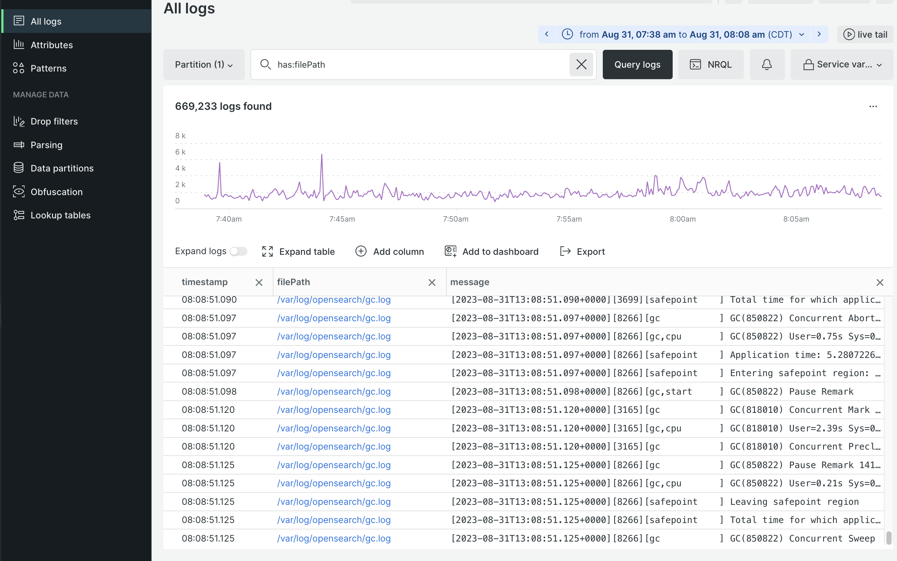

# Gestione registro New Relic

Tutti i progetti di infrastruttura cloud includono [Gestione registro New Relic](https://docs.newrelic.com/docs/logs/get-started/get-started-log-management/). Il servizio è preconfigurato per aggregare tutti i dati di registro dagli ambienti di staging e produzione e visualizzarli in un dashboard di gestione dei registri centralizzato.

I dati aggregati includono informazioni provenienti dai seguenti registri:

- Tutti i `ece-tools` e i registri applicazioni dalla directory `~/var/log`
- Registra i servizi cloud dalla directory `var/log/platform/<project-ID>`
- Fastly CDN e WAF

Quando il progetto è connesso a New Relic, è possibile utilizzare il servizio Registri di New Relic per completare attività come le seguenti:

- Utilizzare le query New Relic per cercare dati di registro aggregati
- Visualizzare i dati di registro tramite l’applicazione New Relic Logs
- Creare grafici, dashboard e avvisi personalizzati
- Risolvere i problemi relativi alle prestazioni da un singolo dashboard

## Visualizzare e analizzare i dati di registro

Utilizza l’applicazione New Relic Logs per eseguire ricerche nei dati di registro aggregati e risolvere gli errori relativi ad applicazioni, infrastrutture, CDN e WAF. È possibile creare grafici, dashboard e avvisi utilizzando i dati di registro raccolti dai servizi New Relic APM e Infrastructure.

**Per utilizzare l&#39;applicazione New Relic Logs**:

1. Accedi al tuo [account New Relic](https://login.newrelic.com/login).

1. Selezionare **Registri** dal menu di navigazione di Explorer.

1. Verifica che il tuo account sia selezionato nella parte superiore della visualizzazione _Tutti i registri_.

1. Selezionare un intervallo di tempo per la query Registri.

1. Per esaminare i dati del registro dell&#39;infrastruttura per i servizi cloud (registri da `~/var/log/`), immettere la stringa di query `has: "filePath"` nel campo _Cerca registri_. Quindi fare clic su **[!UICONTROL Query logs]**.

   I nomi dei file di log sono memorizzati nella colonna `filePath`, con percorsi completi del file di log.

   

1. Per esaminare i dati di log Fastly, immettere la stringa di query `has: "client_ip"` nel campo _Cerca registri_. Quindi fare clic su **[!UICONTROL Query logs]**.

1. Per filtrare i risultati del log Fastly in base al codice paese, fare clic su **[!UICONTROL Add column]**, quindi selezionare **[!UICONTROL geo_country_code]**.

   

>[!TIP]
>
>Puoi salvare la visualizzazione query dal menu a discesa _Visualizzazioni salvate_. Fare clic su **[!UICONTROL Create new]**, specificare un nome, selezionare le opzioni e fare clic su **[!UICONTROL Save view]**.
>
>Consulta [Introduzione alla gestione dei registri](https://docs.newrelic.com/docs/logs/get-started/get-started-log-management/) e [Introduzione al linguaggio di query New Relic](https://docs.newrelic.com/docs/query-your-data/nrql-new-relic-query-language/get-started/introduction-nrql-new-relics-query-language/) nel sito _Documentazione di New Relic_.
