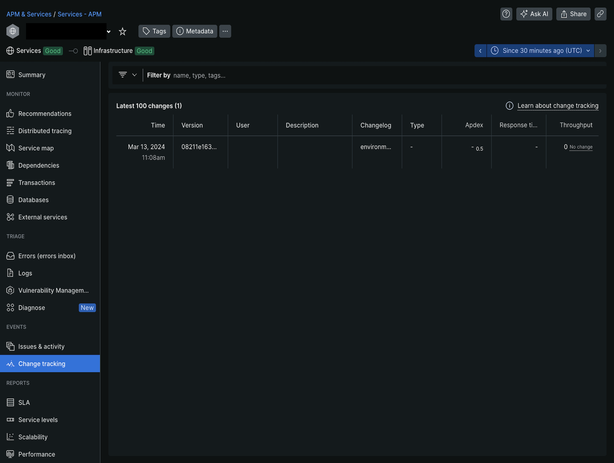

# Tracciare le distribuzioni

Puoi abilitare la funzione _Rileva modifiche_ di New Relic per monitorare gli eventi di distribuzione nel progetto di infrastruttura cloud Commerce.

La raccolta dati sulle implementazioni consente di analizzare l’impatto delle modifiche apportate alle prestazioni complessive, ad esempio CPU, memoria, tempo di risposta e altro ancora. Vedi [Rileva modifiche utilizzando NerdGraph](https://docs.newrelic.com/docs/change-tracking/change-tracking-graphql/) nella _documentazione di New Relic_.

>[!PREREQUISITES]
>
>- `NR_API_URL`: endpoint API New Relic, in questo caso URL API NerdGraph `https://api.newrelic.com/graphql`
>- `NR_API_KEY`: creare una chiave utente. Vedere [Chiavi API New Relic](https://docs.newrelic.com/docs/apis/intro-apis/new-relic-api-keys) nella documentazione di _New Relic_.
>- `NR_APP_GUID`: un&#39;entità che segnala i dati a New Relic ha un ID univoco (GUID). Ad esempio, per abilitare in un ambiente di staging, regolare la variabile cloud dell&#39;ambiente di staging `NR_APP_GUID` con il GUID _dell&#39;entità di staging_ da New Relic. Consulta l&#39;[Esercitazione sulle entità New Relic](https://docs.newrelic.com/docs/new-relic-solutions/new-relic-one/core-concepts/what-entity-new-relic/) e [Esercitazione NerdGraph: visualizzare i dati delle entità](https://docs.newrelic.com/docs/apis/nerdgraph/examples/nerdgraph-entities-api-tutorial/) nella documentazione di _New Relic_.

## Abilita tracciamento distribuzioni

Tieni traccia degli eventi di distribuzione del progetto Commerce in New Relic creando un&#39;integrazione _script_.

**Per abilitare le distribuzioni di tracciamento**:

1. Sulla workstation locale, passa alla directory del progetto.
1. Crea un file `action-integration.js`. Copiare il codice seguente e incollarlo nel file `action-integration.js` e salvarlo:

   ```javascript
   function trackDeployments() {
     const envName = activity.payload.environment.name;
     let variables;
     activity.payload.deployment.variables.forEach(function(variable) {
       if (variable.name === "env:NR_CONFIG") {
         variables = variable.value;
       }
     });
     const config = JSON.parse(variables.replace(/'/g, '"'));
     const commitSha = activity.payload.commits ? activity.payload.commits[0].sha : activity.payload.environment.head_commit;
     const deploymentType = activity.type;
   
     if (!(envName in config)) {
       throw new Error('There is no configuration for ' + envName);
     }
   
     const configEnv = config[envName];
   
     if (!configEnv.NR_APP_GUID || !configEnv.NR_API_KEY || !configEnv.NR_API_URL) {
       throw new Error('You must define the next configuation in the env variable NR_CONFIG: NR_APP_GUID, NR_API_KEY and NR_API_URL');
     }
   
     const query = `mutation {
       changeTrackingCreateDeployment(
       deployment: {
           version: "${commitSha}",
           entityGuid: "${configEnv.NR_APP_GUID}",
           commit: "${commitSha}",
           changelog: "${deploymentType}"
       }
       ) {
         deploymentId
         entityGuid
       }
     }`;
   
     var resp = fetch(configEnv.NR_API_URL, {
       method: 'POST',
       headers: {
           'Content-Type': 'application/json',
           'API-Key': configEnv.NR_API_KEY
       },
       body: JSON.stringify({
           query
       })
     });
   
     if (!resp.ok) {
       console.log('Sending new relic change tracking failed: ' + resp.text());
     } else {
       console.log(resp.text());
     }
   }
   
   trackDeployments();
   ```

1. Creare un&#39;integrazione _script_ utilizzando il comando CLI `magento-cloud` e fare riferimento al file `action-integration.js`.

   ```bash
   magento-cloud integration:add --type script --events='environment.restore, environment.push, environment.branch, environment.activate, environment.synchronize, environment.initialize, environment.merge, environment.redeploy, environment.variable.create, environment.variable.delete, environment.variable.update' --file ./action-integration.js --project=<YOUR_PROJECT_ID> --environments=<YOUR_ENVIRONMENT_ID>
   ```

   Risposta di esempio:

   ```
   Created integration 767u4hathojjw (type: script)
   +-----------------------+-----------------------------------------------------------------------------------------------------------------------------------------+
   | Property              | Value                                                                                                                                   |
   +-----------------------+-----------------------------------------------------------------------------------------------------------------------------------------+
   | id                    | 767u4hathojjw                                                                                                                           |
   | type                  | script                                                                                                                                  |
   | role                  |                                                                                                                                         |
   | events                | - environment.restore                                                                                                                   |
   |                       | - environment.push                                                                                                                      |
   |                       | - environment.branch                                                                                                                    |
   |                       | - environment.activate                                                                                                                  |
   |                       | - environment.synchronize                                                                                                               |
   |                       | - environment.initialize                                                                                                                |
   |                       | - environment.merge                                                                                                                     |
   |                       | - environment.redeploy                                                                                                                  |
   |                       | - environment.variable.create                                                                                                           |
   |                       | - environment.variable.delete                                                                                                           |
   |                       | - environment.variable.update                                                                                                           |
   | environments          | - staging                                                                                                                               |
   |                       | - production                                                                                                                            |
   | excluded_environments | {  }                                                                                                                                    |
   | states                | - complete                                                                                                                              |
   | result                | *                                                                                                                                       |
   | script                | function variables() {                                                                                                                  |
   |                       |     var vars = {};                                                                                                                      |
   |                       |     activity.payload.deployment.variables.forEach(function(variable) {                                                                  |
   |                       |         vars[variable.name] = variable.value;                                                                                           |
   |                       |     });                                                                                                                                 |
   |                       |     return vars;                                                                                                                        |
   |                       | }                                                                                                                                       |
   |                       |                                                                                                                                         |
   |                       | function trackDeployments() {                                                                                                           |
   |                       |     const envName = activity.payload.environment.name;                                                                                  |
   |                       |                                                                                                                                         |
   |                       |     const config = JSON.parse(variables()['env:NR_CONFIG'].replace(/'/g, '"'));                                                         |
   |                       |     const commitSha = activity.payload.commits ? activity.payload.commits[0].sha : activity.payload.environment.head_commit;            |
   |                       |     const deploymentType = activity.type;                                                                                               |
   |                       |                                                                                                                                         |
   |                       |     if (!(envName in config)) {                                                                                                         |
   |                       |         throw new Error('There is no configuration for ' + envName);                                                                    |
   |                       |     }                                                                                                                                   |
   |                       |                                                                                                                                         |
   |                       |     const configEnv = config[envName];                                                                                                  |
   |                       |                                                                                                                                         |
   |                       |     if (!configEnv.NR_APP_GUID || !configEnv.NR_API_KEY || !configEnv.NR_API_URL) {                                                     |
   |                       |         throw new Error('You must define the next configuation in the env variable NR_CONFIG: NR_APP_GUID, NR_API_KEY and NR_API_URL'); |
   |                       |     }                                                                                                                                   |
   |                       |                                                                                                                                         |
   |                       |     const query = `mutation {                                                                                                           |
   |                       |         changeTrackingCreateDeployment(                                                                                                 |
   |                       |           deployment: {                                                                                                                 |
   |                       |             version: "${commitSha}",                                                                                                    |
   |                       |             entityGuid: "${configEnv.NR_APP_GUID}",                                                                                     |
   |                       |             commit: "${commitSha}",                                                                                                     |
   |                       |             changelog: "${deploymentType}"                                                                                              |
   |                       |           }                                                                                                                             |
   |                       |         ) {                                                                                                                             |
   |                       |           deploymentId                                                                                                                  |
   |                       |           entityGuid                                                                                                                    |
   |                       |         }                                                                                                                               |
   |                       |     }`;                                                                                                                                 |
   |                       |                                                                                                                                         |
   |                       |     var resp = fetch(configEnv.NR_API_URL, {                                                                                            |
   |                       |         method: 'POST',                                                                                                                 |
   |                       |         headers: {                                                                                                                      |
   |                       |             'Content-Type': 'application/json',                                                                                         |
   |                       |             'API-Key': configEnv.NR_API_KEY                                                                                             |
   |                       |         },                                                                                                                              |
   |                       |         body: JSON.stringify({                                                                                                          |
   |                       |             query                                                                                                                       |
   |                       |         })                                                                                                                              |
   |                       |     });                                                                                                                                 |
   |                       |                                                                                                                                         |
   |                       |     if (!resp.ok) {                                                                                                                     |
   |                       |         console.log('Sending new relic change tracking failed: ' + resp.text());                                                        |
   |                       |     } else {                                                                                                                            |
   |                       |         console.log(resp.text());                                                                                                       |
   |                       |     }                                                                                                                                   |
   |                       | }                                                                                                                                       |
   |                       |                                                                                                                                         |
   |                       | trackDeployments();                                                                                                                     |
   |                       |                                                                                                                                         |
   +-----------------------+-----------------------------------------------------------------------------------------------------------------------------------------+
   ```

1. Prendi nota dell’ID integrazione per un utilizzo successivo. In questo esempio, l’ID è:

   ```
   Created integration 767u4hathojjw (type: script)
   ```

   Facoltativamente, puoi verificare l&#39;integrazione e prendere nota dell&#39;ID integrazione utilizzando: `magento-cloud integration:list`

1. Crea la variabile di ambiente utilizzando i prerequisiti.

   ```bash
   magento-cloud variable:create --level project --name=env:NR_CONFIG --value='{"<YOUR_ENVIRONMENT_ID>":{"NR_API_KEY": "<YOUR_API_KEY>", "NR_API_URL": "https://api.newrelic.com/graphql", "NR_APP_GUID":"<YOUR_APP_GUID>"}}'  -p <YOUR_PROJECT_ID>
   ```

1. Esaminare l&#39;ultimo registro attività.

   ```bash
   magento-cloud integration:activity:log <INTEGRATION_ID> -p <YOUR_PROJECT_ID> -e <YOUR_ENVIRONMENT_ID>
   ```

   Risposta:

   ```
   Integration ID: 767u4hathojjw
   Activity ID: poxqidsfajkmg
   Type: integration.script
   Description: Running activity script
   Created: 2023-08-28T20:32:02+00:00
   State: complete
   Log:
   HTTP request
   HTTP response
   {"data":{"changeTrackingCreateDeployment":{"deploymentId":"some-deployment-id","entityGuid":"SomeGUIDhere"}}}
   ```

1. Accedi al tuo [account New Relic](https://login.newrelic.com/login).

1. Nel menu di navigazione di Explorer, fare clic su **[!UICONTROL APM & Services]**. Selezionare l&#39;ambiente [!UICONTROL Name] e [!UICONTROL Account].

1. In _Eventi_, fare clic su **[!UICONTROL Change tracking]**.

   
