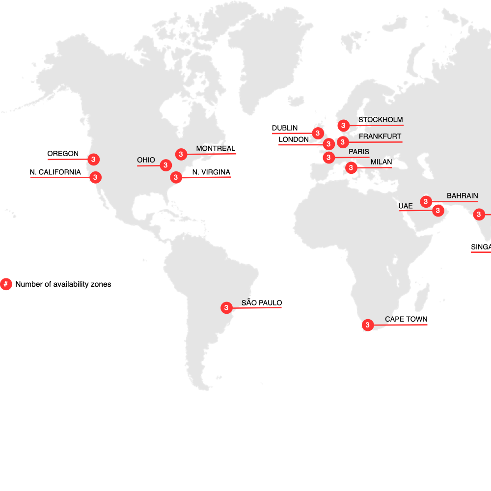

# Commerce su infrastruttura cloud

Adobe Commerce su infrastruttura cloud fornisce una piattaforma di hosting automatizzata con un approccio **self-service** per la creazione, la distribuzione e la gestione dell&#39;applicazione [!DNL Commerce] in un ambiente nativo per il cloud. Adobe Commerce on cloud infrastructure è dotato di funzioni aggiuntive che lo distinguono dalle piattaforme Adobe Commerce e Magento Open Source on-premise:

- Infrastruttura preconfigurata che include PHP, MySQL (MariaDB), Redis, servizi della coda messaggi ([!DNL RabbitMQ] o [!DNL ActiveMQ]) e tecnologie dei motori di ricerca supportate.
- Flusso di lavoro basato su Git con generazione e distribuzione automatiche per uno sviluppo rapido e una distribuzione continua efficienti ogni volta che si inviano modifiche al codice in un ambiente Platform as a Service (PaaS).
- File di configurazione dell’ambiente altamente personalizzabili e strumenti CLI (Command-Line Interface) per la gestione e l’implementazione.
- Hosting Amazon Web Services (AWS) che offre un ambiente scalabile e sicuro per le vendite online e la vendita al dettaglio.

>[!NOTE]
>
>Per ulteriori informazioni sulla protezione, fare riferimento all&#39;[elenco di controllo per l&#39;avvio della protezione](https://experienceleague.adobe.com/en/docs/commerce-on-cloud/user-guide/launch/checklist#security-configuration).

Visualizza lo [stack di tecnologia](architecture/tech-stack.md) in dettaglio o scopri ulteriori informazioni sulle caratteristiche specifiche e sui prodotti supportati nell&#39;architettura [Cloud per Commerce](architecture/cloud-architecture.md).

## Aree geografiche cloud

Le sezioni seguenti forniscono dettagli sulle diverse aree geografiche di AWS e Azure disponibili per Adobe Commerce sull’infrastruttura cloud.

## Aree geografiche di AWS

{zoomable="yes"}

>[!NOTE]
>
> Solo on-premise in Cina e in Russia.

## Aree geografiche di Azure

{zoomable="yes"}

>[!NOTE]
>
> Solo on-premise in Cina e in Russia. Tutti i commercianti che richiedono ambienti di integrazione devono utilizzare aree geografiche degli Stati Uniti.

## Documentazione di Adobe Commerce

La guida all’infrastruttura cloud di Commerce presuppone che tu abbia una certa conoscenza operativa e comprensione dell’applicazione Adobe Commerce. Fare riferimento alle guide per sviluppatori e utenti di [!DNL Commerce] di seguito:

- [Documentazione per gli sviluppatori di Adobe Commerce](https://developer.adobe.com/commerce/docs/) (sito Adobe Developer): sviluppo, personalizzazione, integrazione, estensione e utilizzo di funzionalità avanzate

- [Documentazione di Adobe Commerce](https://experienceleague.adobe.com/docs/commerce.html) (Adobe Experience League): pianificazione, implementazione, funzionamento, aggiornamento e manutenzione dei [!DNL Commerce] progetti

{{$include /help/_includes/templated/whats-new.md}}

<!-- Last updated from includes: 2026-05-13 23:38:24 -->
