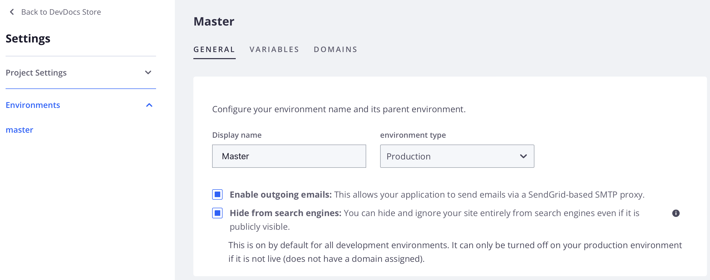

# Configurare le e-mail in uscita

È possibile abilitare e disabilitare le e-mail in uscita per gli ambienti di integrazione (e gestione temporanea solo per Starter) da [!DNL Cloud Console] o dalla riga di comando. Abilita le e-mail in uscita per inviare messaggi di autenticazione a due fattori o reimpostare le e-mail con password per gli utenti del progetto Cloud.

Per impostazione predefinita, le e-mail in uscita sono abilitate negli ambienti di produzione e staging (solo Pro). Tuttavia, l&#39;impostazione **[!UICONTROL Enable outgoing emails]** potrebbe apparire disabilitata nelle impostazioni dell&#39;ambiente indipendentemente dallo stato finché non si imposta la proprietà `enable_smtp` tramite la [riga di comando](#enable-emails-in-the-cli) o la [console cloud](outgoing-emails.md#enable-emails-in-the-cloud-console).

L&#39;aggiornamento del valore della proprietà `enable_smtp` da [riga di comando](#enable-emails-in-the-cli) comporta anche la modifica del valore dell&#39;impostazione [!UICONTROL Enable outgoing emails] per questo ambiente nella console cloud.

>[!NOTE]
>
>Se si abilita/disabilita l&#39;impostazione **[!UICONTROL Enable outgoing emails]**, le e-mail non verranno abilitate/disabilitate negli ambienti di staging o produzione di Pro.

{{redeploy-warning}}

## Abilitare le e-mail nella console Cloud

Utilizza l&#39;interruttore **[!UICONTROL Outgoing emails]** nella visualizzazione _Configura ambiente_ per abilitare o disabilitare il supporto e-mail.

Se le e-mail in uscita devono essere disabilitate o riabilitate negli ambienti di produzione o staging di Pro, puoi inviare un [ticket di supporto Adobe Commerce](https://experienceleague.adobe.com/it/docs/commerce-knowledge-base/kb/help-center-guide/magento-help-center-user-guide).

>[!TIP]
>
>Lo stato delle e-mail in uscita potrebbe non essere riportato per gli ambienti di staging o produzione Pro nella console cloud.

**Per gestire il supporto e-mail da[!DNL Cloud Console]**:

1. Accedi a [[!DNL Cloud Console]](https://console.adobecommerce.com).
1. Selezionare un progetto dall&#39;elenco _Tutti i progetti_.
1. Nel dashboard Progetto, fai clic sull’icona di configurazione in alto a destra.
1. Fare clic su **[!UICONTROL Environments]** e selezionare un ambiente specifico dall&#39;elenco (eccetto Gestione temporanea e produzione per Pro).
1. Per abilitare o disabilitare le e-mail in uscita, attiva _Abilita e-mail in uscita_ **On** o **Off**.

   

Dopo aver modificato l’impostazione, l’ambiente viene generato e distribuito con la nuova configurazione.

## Abilitare le e-mail in CLI

È possibile modificare la configurazione e-mail per un ambiente attivo utilizzando il comando `magento-cloud` CLI `environment:info` per impostare la proprietà `enable_smtp`. L&#39;attivazione di SMTP aggiorna la variabile di ambiente `MAGENTO_CLOUD_SMTP_HOST` con l&#39;indirizzo IP dell&#39;host SMTP per l&#39;invio della posta.

**Per gestire il supporto e-mail dalla riga di comando**:

1. Sulla workstation locale, passa alla directory del progetto.

1. Controlla l’impostazione dell’e-mail in uscita per l’ambiente.

   ```bash
   magento-cloud environment:info -e <environment-id> | grep enable_smtp
   ```

1. Modificare la configurazione del supporto e-mail impostando la variabile di ambiente `enable_smtp` su `true` o `false`.

   ```bash
   magento-cloud environment:info --refresh -e <environment-id> enable_smtp true
   ```

   Attendi che l’ambiente venga generato e implementato.

1. Utilizza un SSH per accedere all’ambiente remoto.

1. Verifica che l’e-mail funzioni; invia un’e-mail di test a un indirizzo che puoi controllare.

   ```bash
   php -r 'mail("mail@example.com", "test message", "just testing", "From: tester@example.com");'
   ```

1. Verificare che l&#39;e-mail sia stata selezionata da SendGrid.

   ```bash
   grep mail@example.com /var/log/mail.log
   ```
