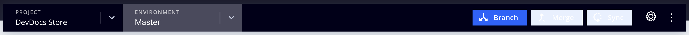

# Progetto infrastruttura cloud

Il progetto Adobe Commerce su infrastruttura cloud include tutto il codice nei rami Git, negli ambienti associati e negli script per distribuire l&#39;applicazione [!DNL Commerce]. Gli ambienti contengono servizi per il supporto dell&#39;applicazione [!DNL Commerce], tra cui un database, un server Web e un server di caching.

Adobe fornisce un [!DNL Cloud Console] e strumenti per sviluppatori per gestire completamente tutti gli aspetti del progetto. In qualità di proprietario dell’account, puoi accedere a tutti gli ambienti.

## [!DNL Cloud Console]

[!DNL Cloud Console] fornisce metodi interattivi per generare, gestire e distribuire il codice Commerce in un formato semplice da usare. [Accedi a [!DNL Cloud Console]](https://console.adobecommerce.com) per visualizzare l&#39;elenco dei progetti. Puoi visualizzare solo i progetti per i quali disponi delle autorizzazioni di accesso come amministratore o per tipi di ambiente specifici. I partner Adobe Solutions possono visualizzare più progetti per i clienti supportati.

>[!TIP]
>
>Se non trovi alcun progetto, contatta il [Proprietario account o l&#39;amministratore del progetto](../project/user-access.md) associato al progetto e richiedi l&#39;accesso. Per i nuovi utenti, vedere l&#39;argomento [Onboarding](../../get-started/onboarding.md#cloud-console) nella guida _Introduzione_.

Nella visualizzazione _Tutti i progetti_ sono elencati tutti i progetti per i quali si dispone dell&#39;autorizzazione di accesso. È possibile fare clic su **[!UICONTROL Show filters]** e filtrare l&#39;elenco dei progetti per tipo, area geografica o piano.


### Panoramica del progetto

Selezionando un progetto dall&#39;elenco _Tutti i progetti_ si apre la panoramica del progetto. Nella panoramica del progetto viene sempre visualizzata una barra di navigazione del progetto, che include un selettore di ambiente e un pulsante di configurazione:


Se non è selezionato alcun ambiente, nella panoramica del progetto viene visualizzato un riepilogo dei dettagli del progetto nell&#39;area di anteprima:

- Nome progetto
- Regione, ID progetto
- Pianificazione, storage allocato, ambienti, utenti
- URL Storefront con pulsante **[!UICONTROL Set a custom domain]**

E nella panoramica del progetto principale:

- La vista Ambienti mostra una vista a elenco o struttura di {width="32"} (active) and {width="32"} (inattivi).
- [Il flusso di attività](activity-stream.md) mostra le attività in esecuzione, in sospeso e recenti per il progetto.
<!-- - Apps & Services—Shows a topology of service containers -->

Per i progetti **Starter**, esiste una gerarchia di rami che inizia da `master` (Produzione). Qualsiasi ramo creato viene visualizzato come secondario dal ramo `master`. Adobe consiglia di creare un ramo `staging`, quindi di creare un ramo `integration` per lo sviluppo. Vedi [Architettura Starter](../architecture/starter-architecture.md).

Per **Pro**, esiste una gerarchia di rami che inizia da `production` a `staging` e termina con `integration`. L&#39;icona {width="32"} indica che il ramo viene distribuito in un ambiente dedicato. Tutti i rami creati vengono visualizzati come figli del ramo `integration`. Vedi [Architettura Pro](../architecture/pro-architecture.md).


### Panoramica dell’ambiente

Selezionando un ambiente dalla barra di navigazione del progetto, la panoramica e la barra di navigazione si concentrano sull’ambiente selezionato. La barra di navigazione include i controlli dei rami (Branch, Merge e Sync) e un pulsante di configurazione:



La panoramica dell’ambiente mostra un riepilogo dei dettagli dell’ambiente nell’area di anteprima:

- Nome ambiente, tipo
- Regione, ID progetto
- Data e ora dell&#39;ultima attività, incluso il backup
- Accesso HTTP e stato del motore di ricerca
- Nome computer assegnato all’ambiente
- Stato dell’ambiente (attivo o inattivo)
- URL Storefront con pulsante **[!UICONTROL Set a custom domain]**

E nella panoramica dell’ambiente principale:

- [Il flusso di attività](activity-stream.md) costituisce la panoramica dell&#39;ambiente principale e mostra le attività in esecuzione, in sospeso e recenti per l&#39;ambiente selezionato.
<!-- - Services tab shows and Apps & Services menu, including overview and configuration tabs for each service. -->
- La [scheda Backup](../storage/snapshots.md#create-a-manual-backup) fornisce un elenco dei backup archiviati, la cronologia delle azioni di backup e il pulsante Backup.

### Accedi alla vetrina

Ogni ambiente attivo ha una vetrina. Seleziona un ambiente dalla navigazione in alto e fai clic sull’URL nella panoramica dell’ambiente. Inoltre, è presente un elenco **[!UICONTROL URLs]** sul lato destro sopra l&#39;elenco Attività.

L’URL di accesso web può includere quanto segue:

```
https://<branch>-<unique-ID>-<project-ID>.<region>.magentosite.cloud/
```

- **ID univoco** = 7 caratteri alfanumerici casuali
- **ID progetto** = ID progetto di 13 caratteri
- **Area** = nome area AWS o Azure, vedere [Indirizzi IP regionali](regional-ip-addresses.md)

Gli ambienti Pro Production e Staging includono tre nodi a cui è possibile accedere utilizzando i seguenti collegamenti:

- URL del load balancer:

   - `http[s]://<your-domain>.c.<project-ID>.ent.magento.cloud`
   - `http[s]://<your-staging-domain>.c.<project-ID>.ent.magento.cloud`

- Accesso diretto a uno dei tre server ridondanti:

   - `http[s]://<your-domain>.{1|2|3}.<project-ID>.ent.magento.cloud`
   - `http[s]://<your-staging-domain>.{1|2|3}.<project-ID>.ent.magento.cloud`

  L’URL di produzione viene utilizzato dalla rete CDN (Content Delivery Network).

## Impostazioni

Apri il pannello _Impostazioni_ facendo clic sull&#39;icona {width="36"} (configura) sul lato destro della navigazione del progetto.

### Impostazioni progetto

**[!UICONTROL Project Settings]** espande un menu di controlli a livello di progetto per gestire utenti, variabili e altro ancora:

| Opzione | Descrizione |
|--------------|-------------------------------------------------------------------------------------------------------------------------------|
| Generale | Gestire il fuso orario da utilizzare con la pianificazione dei backup o della manutenzione. |
| Accesso | Gestisci l&#39;[accesso utente](user-access.md) ai tipi di progetto e ambiente. |
| Certificati | Visualizza un elenco dei certificati SSL associati al progetto. |
| Distribuisci chiave | Aggiungi e visualizza la chiave pubblica nell’archivio del codice del progetto. |
| Domini | Aggiungi un nome di dominio al progetto. Vedi [Gestione domini](../cdn/fastly-custom-cache-configuration.md#manage-domains). |
| Integrazioni | Aggiungi e gestisci [integrazioni](../integrations/overview.md), ad esempio notifiche di integrità e webhook. |
| Variabili | Aggiungi [variabili a livello di progetto](../environment/variable-levels.md) disponibili in fase di compilazione e runtime in tutti gli ambienti. |

{style="table-layout:auto"}

### Impostazioni dell’ambiente

Fare clic su **[!UICONTROL Environments]** e selezionare un ambiente specifico dall&#39;elenco per i controlli per la gestione delle impostazioni del sito, delle variabili di ambiente e altro ancora:

| Opzione | Descrizione |
| --------- | -------------------------------------------------------------------------------------------------------------------------------- |
| Generale | Configura il nome visualizzato, il tipo di ambiente e l’ambiente principale.<br>Attiva/disattiva impostazioni di ambiente diverse: |
|           | **Abilita e-mail in uscita**: invia [e-mail in uscita](outgoing-emails.md) dall&#39;ambiente utilizzando il protocollo SMTP. |
|           | **Nascondi dai motori di ricerca**: blocca gli indicizzatori e i crawler dei motori di ricerca dal sito. |
|           | **Controllo dell&#39;accesso HTTP**: abilitare la configurazione della sicurezza per [!DNL Cloud Console] utilizzando un controllo dell&#39;accesso e un controllo dell&#39;accesso all&#39;indirizzo IP. |
|           | Stato: `active` o `inactive`. La maggior parte del lavoro si svolge in un ambiente attivo. Puoi disattivare o eliminare l’ambiente. |
| Variabili | Visualizza, crea e gestisci [variabili a livello di ambiente](../environment/variable-levels.md) disponibili in fase di esecuzione. |
| Domini | Visualizza un elenco di [route configurate](../routes/routes-yaml.md). |

{style="table-layout:auto"}

>[!WARNING]
>
>**DO NOT** utilizza il metodo di controllo degli accessi HTTP per proteggere gli ambienti di staging e produzione Pro. Questo interrompe il caching rapido. Utilizza invece la funzionalità [Blocco](../cdn/fastly-vcl-blocking.md) disponibile nella rete CDN Fastly per Adobe Commerce.

## Credenziali Fastly e New Relic

Il progetto include [Fastly](../cdn/fastly.md) e [New Relic](../monitor/new-relic-service.md). Nei dettagli del progetto vengono visualizzate le informazioni per il piano del progetto e le licenze e i token importanti per queste integrazioni. Solo il Proprietario della licenza ha accesso iniziale alle credenziali e ai servizi. Fornisci queste credenziali alle risorse tecniche e per sviluppatori in base alle esigenze.

- [Fastly](https://www.fastly.com/) offre servizi di distribuzione dei contenuti (CDN), ottimizzazione delle immagini e servizi di sicurezza (DDoS e WAF) per i progetti Adobe Commerce su infrastrutture cloud. Vedi [Ottieni credenziali rapide](../cdn/fastly-configuration.md#get-fastly-credentials).

- [New Relic](../monitor/new-relic-service.md) fornisce metriche dell&#39;applicazione e informazioni sulle prestazioni per gli ambienti di staging e produzione.

Utilizza [Cloud CLI](../dev-tools/cloud-cli-overview.md) per rivedere i token di integrazione, gli ID e altro ancora:

```bash
magento-cloud subscription:info services
```
