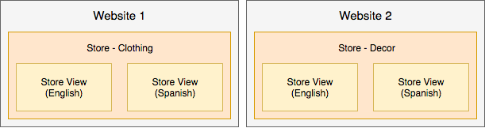

# Best practice per la configurazione dell’archivio

Per informazioni dettagliate sulla configurazione di store, siti Web e siti Web, consultare la [Guida utente di Adobe Commerce](https://experienceleague.adobe.com/docs/commerce-admin/user-guides/home.html). Questa pagina fornisce best practice, informazioni utili e linee guida per la configurazione di store, siti e altro ancora con contenuti aggiuntivi da pubblicare nel tempo e tra versioni diverse.

## Campagne di marketing e promozioni

Queste informazioni sono utili per Adobe Commerce sull’infrastruttura cloud 2.1.X e 2.2.X.

Per creare campagne e promozioni, crea le opzioni e le impostazioni in [Gestione temporanea dei contenuti](https://experienceleague.adobe.com/docs/commerce-admin/content-design/staging/content-staging.html). Questa funzione ti consente di creare e visualizzare in anteprima le campagne prima di renderle pubbliche per le vendite ai clienti. Di seguito sono riportate informazioni utili. Per istruzioni esatte, consulta il contenuto della Guida utente di Adobe Commerce collegato.

_Le campagne_ sono eventi di marketing per vendite stagionali, nuove linee di prodotti e altro ancora. Ogni campagna può includere temi personalizzati, blocchi per il contenuto, widget per controllare e visualizzare il contenuto e promozioni associate con regole di prezzo. A causa della natura estesa di una campagna, puoi crearle con una data di inizio e una data di fine attraverso la gestione temporanea del contenuto.

_Le promozioni_ forniscono sconti, offerte una tantum, coupon, incentivi per nuovi acquirenti e altro ancora. Queste promozioni vengono create come _Regole di prezzo_ che impostano i termini, gli sconti e le opzioni per incoraggiare i clienti ad acquistare. Puoi creare regole di prezzo sul [carrello](https://experienceleague.adobe.com/docs/commerce-admin/marketing/promotions/cart-rules/price-rules-cart.html) o [catalogo](https://experienceleague.adobe.com/docs/commerce-admin/marketing/promotions/catalog-rules/price-rules-catalog.html), con opzioni aggiuntive per banner, punti premio e altro ancora. Puoi pianificare campagne per le promozioni, applicando regole di prezzo per eventi importanti come una nuova linea di prodotti o vendite stagionali.

Di seguito sono riportati suggerimenti per creare, aggiornare e gestire promozioni e campagne:

* Una promozione può far parte di una campagna. Una campagna non può far parte di una promozione. È possibile disporre di elenchi di promozioni come regole di prezzo da utilizzare più volte, con più campagne.
* Quando crei una promozione, viene sempre creata una campagna iniziale inattiva. Ha una data di inizio ma non una data di fine. Puoi ignorare questa campagna iniziale. Puoi pianificare un nuovo aggiornamento con la pianificazione della campagna corretta e renderla attiva.
* Una campagna ha una data di inizio e una data di fine, non una promozione. La pianificazione visualizzata quando si crea una promozione non configura le date di inizio e di fine per la promozione. Ti consente di pianificare una campagna per questa promozione mentre ti trovi nella pagina di configurazione della promozione.
* Non è possibile modificare direttamente in Staged Content (Contenuto in staging). Se devi modificare le impostazioni e le opzioni nella campagna, modifica l’originale o una replica e invia per sovrascrivere in Staged Content (Contenuto in staging). Ad esempio, se non specifichi una data di fine per una campagna, devi modificare l’originale e inviarlo per l’aggiornamento.

## Advanced Pricing e contenuti in staging

Queste informazioni sono utili per Adobe Commerce sull’infrastruttura cloud 2.1.X e 2.2.X.

In genere, è possibile impostare [Advanced Pricing](https://experienceleague.adobe.com/docs/commerce-admin/catalog/products/pricing/pricing-advanced.html) per i prodotti tramite l&#39;area **Prodotti** > **Cataloghi** dell&#39;amministratore. Con Contenuto in staging, completa alcuni passaggi aggiuntivi per aggiungere il prezzo a una promozione e a una campagna.

Per modificare Advanced Pricing e aggiornare la gestione temporanea dei contenuti:

1. Accedi all’amministratore.
1. Passa a **Prodotti** > **Catalogo** e seleziona un prodotto e modificalo.
1. Nella scheda Determinazione prezzi selezionare **Determinazione prezzi avanzata**. Modifica il prezzo e Salva le modifiche.
1. Nella parte superiore della pagina fare clic su **Pianifica nuovo aggiornamento**.
1. Crea una promozione per il prodotto.
1. Completa le informazioni sulla promozione. Per lo scheduler, immettere una data e un&#39;ora di inizio e di fine.
1. Salva la promozione. Viene creata una campagna iniziale inattiva.
1. Puoi visualizzare in anteprima il prezzo speciale, il nome della promozione, il prezzo regolare e l’intervallo di date pianificato per la campagna.

Per ulteriori informazioni, puoi continuare con le istruzioni [Pianifica modifiche per le regole di prezzo del catalogo](https://experienceleague.adobe.com/docs/commerce-admin/marketing/promotions/catalog-rules/price-rule-catalog-scheduled-changes.html). Fai clic su **Avanti** per eseguire i passaggi.

## Regole di prezzo

Le regole di prezzo possono includere logica e condizioni illimitate come l’immaginazione di marketing. Alcuni esempi popolari includono Buy One Get One Free, Buy One Get One 50% di sconto, $25 di sconto su ordini superiori a $100 dollari e altro ancora.

Per creare una regola di prezzo, vedere [Guida utente di Adobe Commerce](https://experienceleague.adobe.com/docs/commerce-admin/marketing/promotions/catalog-rules/price-rules-catalog-create.html).

Di seguito è riportato un esempio di creazione di una regola di prezzo per uno sconto Solo primo ordine. Per questo sconto, si desidera:

* Crea una regola di prezzo con un [segmento cliente](https://experienceleague.adobe.com/en/docs/commerce-admin/customers/segments/customer-segment-price-rule) con una condizione: Numero totale di ordini inferiore a 1
* Aggiungi questo segmento di clienti come condizione alla regola del carrello
* Facoltativo - Aggiungi condizioni e regole per applicare gli sconti a SKU o categorie di prodotti specifiche per acquisti mirati

In questo modo, i nuovi clienti o i clienti esistenti che non hanno effettuato un acquisto riceveranno lo sconto solo al primo ordine. Puoi creare banner e inviare promozioni e-mail per lo sconto per il primo acquisto.

## Visualizzazioni dello store

Puoi configurare ed eseguire diversi store con una singola implementazione di Adobe Commerce sull’infrastruttura cloud. Vedere [Configurare più siti Web o store](multiple-sites.md).

Per gli archivi che non interagiscono tra loro, è possibile creare più _siti Web_. Ogni sito web dispone di articoli specifici, dati cliente, pagamento e carrello acquisti che non sono condivisi con altri siti web in Adobe Commerce.

Ogni sito Web può includere uno o più _store_ con categorie e articoli diversi, dati cliente condivisi, pagamento e carrello acquisti. Per questi negozi, un cliente può iscriversi una sola volta e fare acquisti in diversi cataloghi di prodotti con un unico pagamento.

È inoltre possibile creare _visualizzazioni store_ per lingue, layout e progettazioni diversi. Ogni vista può avere un dominio, un marchio e una lingua separati per la condivisione di articoli, dati dei clienti, pagamento e carrello.

Di seguito sono riportati alcuni esempi per spiegare meglio:

* Sito Web singolo con un negozio e due visualizzazioni per le impostazioni locali in inglese e spagnolo. Tutti i dati dell’articolo, i clienti, il pagamento e il carrello sono condivisi.

  

* Un sito web unico con un negozio di abbigliamento femminile include due visualizzazioni: una per l&#39;inglese e una per lo spagnolo. Il negozio di abbigliamento per bambini include una singola vista del negozio in inglese. Tutti i dati dell’articolo, i clienti, il pagamento e il carrello sono condivisi. Gli store possono avere domini e temi diversi.

  

* Due siti web uno per l&#39;abbigliamento e un altro per l&#39;arredamento della casa con diversi cataloghi e articoli separati, dati dei clienti e carrello. Ogni sito web può avere più store e visualizzazioni che condividono articoli, dati dei clienti, pagamento e carrello solo all’interno di quel sito web.

  

>[!WARNING]
>
>I dati del catalogo aumentano con l’aumentare del numero di siti web e store. A seconda dell’architettura del progetto, gli archivi aggiuntivi possono comportare un processo di indicizzazione più lungo e tempi di risposta più lenti per le pagine di catalogo non memorizzate nella cache. Adobe consiglia di monitorare attentamente le prestazioni del sito.
