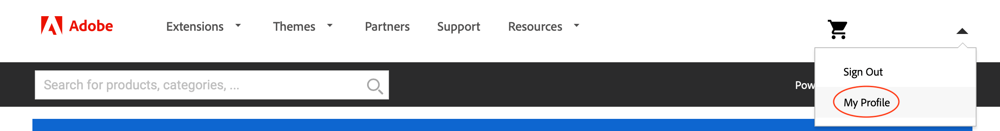

# Gestione estensioni

Puoi estendere le funzionalità dell&#39;applicazione Adobe Commerce aggiungendo un&#39;estensione dalla [Commerce Marketplace](https://marketplace.magento.com). Ad esempio, puoi aggiungere un tema per cambiare l’aspetto della vetrina, oppure un pacchetto per la lingua per localizzare la vetrina e l’amministratore.

>[!NOTE]
>
>Per evitare problemi di installazione, tutti gli acquisti Marketplace devono essere completati utilizzando lo stesso account (MAGEID) proprietario del progetto cloud.

## Nome del compositore di un’estensione

Anche se questa sezione illustra come ottenere il nome e la versione del Compositore da Commerce Marketplace, è possibile trovare il nome e la versione del modulo _any_ nel file Compositore del modulo. Aprire il file `composer.json` in un editor di testo e prendere nota dei valori `"name"` e `"version"`.

**Per ottenere il nome del Compositore di un modulo dalla Commerce Marketplace**:

1. Accedi a [Commerce Marketplace](https://marketplace.magento.com) con il nome utente e la password utilizzati per acquistare il componente.

1. Nell&#39;angolo in alto a destra, fai clic sul tuo nome utente e seleziona **Il mio profilo**.

   

1. Nella pagina _Il mio account_, fai clic su **I miei acquisti**.

   

1. Nella pagina _I miei acquisti_, seleziona un modulo acquistato e fai clic su **Dettagli tecnici**.

1. Fai clic su **Copia** per copiare [!UICONTROL Component name] negli Appunti.

1. Aprire un editor di testo e incollare il nome del componente e aggiungere un carattere due punti (`:`).

1. In **Dettagli tecnici**, fai clic su **Copia** per copiare [!UICONTROL Component version] negli Appunti.

1. Nell’editor di testo, aggiungi il numero di versione al nome del componente dopo i due punti. Ad esempio:

   ```text
   extension-name/magento2:1.0.1
   ```

## Installare un’estensione

Adobe consiglia di lavorare in un ramo di sviluppo quando aggiungi un’estensione all’implementazione. Durante l&#39;installazione di un&#39;estensione, il nome (`<VendorName>_<ComponentName>`) viene inserito automaticamente nel file [`app/etc/config.php`](https://experienceleague.adobe.com/docs/commerce-operations/configuration-guide/files/deployment-files.html). Non è necessario modificare direttamente il file.

**Per installare un&#39;estensione**:

1. Sulla workstation locale, passa alla directory del progetto.

1. Creare o estrarre un ramo di sviluppo. Vedi [diramazione](../development/cli-branches.md).

1. Utilizzando il nome e la versione del Compositore, aggiungere l&#39;estensione alla sezione `require` del file `composer.json`.

   ```bash
   composer require <extension-name>:<version> --no-update
   ```

1. Aggiornare le dipendenze del progetto.

   ```bash
   composer update
   ```

1. Aggiungi, conferma e invia modifiche al codice.

   ```bash
   git add -A
   ```

   ```bash
   git commit -m "Install <extension-name>"
   ```

   ```bash
   git push origin <branch-name>
   ```

   >[!WARNING]
   >
   >Durante l&#39;installazione di un&#39;estensione, è necessario includere il file `composer.lock` quando si inviano le modifiche al codice nell&#39;ambiente remoto. Il comando `composer install` legge il file `composer.lock` per abilitare le dipendenze definite nell&#39;ambiente remoto.

1. Al termine della build e della distribuzione, utilizza un SSH per accedere all’ambiente remoto e verificare che l’estensione sia installata.

   ```bash
   bin/magento module:status <extension-name>
   ```

   Un nome di estensione utilizza il formato: `<VendorName>_<ComponentName>`.

   Risposta di esempio:

   ```
   Module is enabled
   ```

   Se si verificano errori di distribuzione, vedere [errore di distribuzione dell&#39;estensione](../deploy/recover-failed-deployment.md).

## Gestione estensioni

Quando aggiungi un’estensione utilizzando Compositore, il processo di distribuzione la abilita automaticamente. Se l&#39;estensione è già installata, è possibile attivarla o disattivarla utilizzando CLI. Durante la gestione delle estensioni, utilizzare il formato: `<VendorName>_<ComponentName>`

Non abilitare o disabilitare mai un&#39;estensione durante l&#39;accesso agli ambienti remoti.

**Per abilitare o disabilitare un&#39;estensione**:

1. Sulla workstation locale, passa alla directory del progetto.

1. Attivare o disattivare un modulo. Il comando `module` aggiorna il file `config.php` con lo stato richiesto del modulo.

   >Abilita un modulo.

   ```bash
   bin/magento module:enable <module-name>
   ```

   >Disattiva un modulo.

   ```bash
   bin/magento module:disable <module-name>
   ```

1. Se hai attivato un modulo, utilizza `ece-tools` per aggiornare la configurazione.

   ```bash
   ./vendor/bin/ece-tools module:refresh
   ```

1. Verifica lo stato di un modulo.

   ```bash
   bin/magento module:status <module-name>
   ```

1. Aggiungi, conferma e invia modifiche al codice.

   ```bash
   git add -A
   ```

   ```bash
   git commit -m "Disable <extension-name>"
   ```

   ```bash
   git push origin <branch-names>
   ```

## Aggiornare un’estensione

Prima di continuare, è necessario il nome e la versione del Compositore per l’estensione. Inoltre, verifica che l’estensione sia compatibile con il progetto e la versione di Adobe Commerce. In particolare, [controlla la versione PHP richiesta](https://experienceleague.adobe.com/docs/commerce-operations/installation-guide/system-requirements.html) prima di iniziare.

**Per aggiornare un&#39;estensione**:

1. Sulla workstation locale, passa alla directory del progetto.

1. Creare o estrarre un ramo di sviluppo. Vedi [diramazione](../development/cli-branches.md).

1. Aprire il file `composer.json` in un editor di testo.

1. Individua l’estensione e aggiorna la versione.

1. Salva le modifiche e esci dall’editor di testo.

1. Aggiornare le dipendenze del progetto.

   ```bash
   composer update
   ```

1. Aggiungi, esegui il commit e invia le modifiche al codice.

   ```bash
   git add -A
   ```

   ```bash
   git commit -m "Update <extension-name>"
   ```

   ```bash
   git push origin <branch-names>
   ```

In caso di errori, vedere [Ripristino da errore del componente](../deploy/recover-failed-deployment.md). Per ulteriori informazioni sull&#39;utilizzo delle estensioni con Adobe Commerce, consulta [Estensioni](https://experienceleague.adobe.com/docs/commerce-admin/start/resources/extensions.html) nella _Guida per l&#39;amministratore_.
